### CYPLAN255-FINAL PROJECT
# **Factors Affecting Housing Prices in Santa Clara County: *A Hedonic Method***


*Charles Qianchuan LI*


Abstract: 

Housing prices are usually related to multiple factors, and it is important to learn how they can affect the market for future home buyers. Based on the Hedonic Pricing Model and the Geographically Weighted Regression Model, the study analyzes several common factors that could have potential impacts on the local real estate market of Santa Clara County. It shows different weights of different factors and examines the geographical differences among them. 
   
   
   

#### 1. Research Question: *How* do different factors affect housing prices in Santa Clara County?

#### 2. Methodology:
* Hedonic Model [1] : P=αS+βE+γL+ε 
    * P is the vector of property sales or rental prices, and S, E and L are the sets of vectors of structural, environmental and locational attributes, respectively, of the analyzed properties, and α, β and γ are the vectors of estimated regression coefficients, while ɛ is the vector of random error.
    * S: Beds, Baths, Sizes, etc.
    * E: Accessibility to public parks, the number of crime cases, etc.
    * L: Accessibility to tech companies, hospitals, schools, rail stations, etc. 
    
    <br>
* Geographically Weighted Regression Model (GWR) [2]: Yi=β0(ui,vi)+∑βj(ui,vi)Xji+εi
    * yi is the dependent variable, Xji is the jth independent variable, βj (ui,vi)  is the jth coefficient at location (ui,vi), and εi  is the random error term. Unlike OLS, the parameters are allowed to vary by location (ui,vi).
    * GWR is a promoted regression model which provides an effective means to estimate how the same factors may evoke different responses across locations and by so doing, bring to the fore the role of geographical context on human preferences and behavior.
    
    <br>
* General Strategy:
    * Using basic non-spital regression model to conduct basic hedonic analysis.
    * Using GWR component to conduct spatial hedonic analysis.

#### 3. Process:
* I Data Preparation:
Using Census API, Geocoding, Web Scraping, and other tools to acquire and clean relevant data.

* II Data Processing + Analysis(i): 
Using Network Analysis and Spatial Join to get accessibility data and data for regression analysis.

* III Data Processing + Analysis(ii): 
Using Basic Regression Model [3] and Geographically Weighted Regression (GWR)[4] to conduct analysis.

* IV Conclusions + Contributions + Limitations

* V References

 


```python
# imports
import numpy as np
import geopandas as gpd
import pandas as pd
import json    
import requests
import pprint
from pandana.loaders import osm
import warnings
import pandana
import matplotlib
from matplotlib import pyplot as plt
import matplotlib.cm as cm
from mpl_toolkits.axes_grid1 import make_axes_locatable
import networkx as nx
import osmnx as os
from descartes import PolygonPatch
from shapely.geometry import LineString
from shapely.geometry import Point
from shapely.geometry import Polygon
from census import Census
from us import states
import os
import jenkspy
import seaborn as sns
import random
from collections.abc import Mapping
import mapbox
from mapbox import Geocoder
import utm
import math
import lxml
from lxml.html.soupparser import fromstring
from bs4 import BeautifulSoup
import regex as re
import prettify
import numbers
import html_text
import pyproj
from pyproj import CRS
from pyproj import Transformer
import pysal as ps
import spreg
import libpysal
import plotly.express as px
import plotly.graph_objects as go
import libpysal as ps
from libpysal  import weights
from libpysal.weights import Queen
import esda
from esda.moran import Moran, Moran_Local
import splot
from splot.esda import moran_scatterplot, plot_moran, lisa_cluster, plot_local_autocorrelation
from splot.libpysal import plot_spatial_weights
from giddy.directional import Rose
import statsmodels.api as sm
import statsmodels.formula.api as smf
from stargazer.stargazer import Stargazer, LineLocation
from spreg import OLS
from spreg import MoranRes
from spreg import ML_Lag
from spreg import ML_Error 
from mgwr.gwr import GWR, MGWR
from mgwr.sel_bw import Sel_BW
from mgwr.utils import shift_colormap, truncate_colormap
import warnings
warnings.filterwarnings('ignore') 
import time
```

 

## I-Data Preparation

 

#### 1.Demographics (Census API + Dot Density + Interpolate)

  


```python
# Read Base Map through API
tracts=gpd.read_file("https://www2.census.gov/geo/tiger/TIGER2010/TRACT/2010/tl_2010_06_tract10.zip")
tracts.head()
```


<div>
<style scoped>
    .dataframe tbody tr th:only-of-type {
        vertical-align: middle;
    }

    .dataframe tbody tr th {
        vertical-align: top;
    }

    .dataframe thead th {
        text-align: right;
    }
</style>
<table border="1" class="dataframe">
  <thead>
    <tr style="text-align: right;">
      <th></th>
      <th>STATEFP10</th>
      <th>COUNTYFP10</th>
      <th>TRACTCE10</th>
      <th>GEOID10</th>
      <th>NAME10</th>
      <th>NAMELSAD10</th>
      <th>MTFCC10</th>
      <th>FUNCSTAT10</th>
      <th>ALAND10</th>
      <th>AWATER10</th>
      <th>INTPTLAT10</th>
      <th>INTPTLON10</th>
      <th>geometry</th>
    </tr>
  </thead>
  <tbody>
    <tr>
      <th>0</th>
      <td>06</td>
      <td>083</td>
      <td>002103</td>
      <td>06083002103</td>
      <td>21.03</td>
      <td>Census Tract 21.03</td>
      <td>G5020</td>
      <td>S</td>
      <td>2838200</td>
      <td>7603</td>
      <td>+34.9306689</td>
      <td>-120.4270588</td>
      <td>POLYGON ((-120.41794 34.93834, -120.41766 34.9...</td>
    </tr>
    <tr>
      <th>1</th>
      <td>06</td>
      <td>083</td>
      <td>002402</td>
      <td>06083002402</td>
      <td>24.02</td>
      <td>Census Tract 24.02</td>
      <td>G5020</td>
      <td>S</td>
      <td>16288573</td>
      <td>44468</td>
      <td>+34.9287963</td>
      <td>-120.4780833</td>
      <td>POLYGON ((-120.47389 34.92081, -120.47428 34.9...</td>
    </tr>
    <tr>
      <th>2</th>
      <td>06</td>
      <td>083</td>
      <td>002102</td>
      <td>06083002102</td>
      <td>21.02</td>
      <td>Census Tract 21.02</td>
      <td>G5020</td>
      <td>S</td>
      <td>1352551</td>
      <td>0</td>
      <td>+34.9421111</td>
      <td>-120.4267767</td>
      <td>POLYGON ((-120.41766 34.93834, -120.41794 34.9...</td>
    </tr>
    <tr>
      <th>3</th>
      <td>06</td>
      <td>083</td>
      <td>002010</td>
      <td>06083002010</td>
      <td>20.10</td>
      <td>Census Tract 20.10</td>
      <td>G5020</td>
      <td>S</td>
      <td>2417990</td>
      <td>0</td>
      <td>+34.8714281</td>
      <td>-120.4100285</td>
      <td>POLYGON ((-120.41147 34.87962, -120.41141 34.8...</td>
    </tr>
    <tr>
      <th>4</th>
      <td>06</td>
      <td>083</td>
      <td>002009</td>
      <td>06083002009</td>
      <td>20.09</td>
      <td>Census Tract 20.09</td>
      <td>G5020</td>
      <td>S</td>
      <td>2603281</td>
      <td>0</td>
      <td>+34.8722878</td>
      <td>-120.4277159</td>
      <td>POLYGON ((-120.42352 34.87928, -120.42286 34.8...</td>
    </tr>
  </tbody>
</table>
</div>


```python
# Santa Clara Base Map
santa_clara_tract=tracts.loc[tracts['COUNTYFP10'] =='085']
```


```python
# Basic Info
print(santa_clara_tract.crs)
santa_clara_tract.head()
```

    epsg:4269
    


<div>
<style scoped>
    .dataframe tbody tr th:only-of-type {
        vertical-align: middle;
    }

    .dataframe tbody tr th {
        vertical-align: top;
    }

    .dataframe thead th {
        text-align: right;
    }
</style>
<table border="1" class="dataframe">
  <thead>
    <tr style="text-align: right;">
      <th></th>
      <th>STATEFP10</th>
      <th>COUNTYFP10</th>
      <th>TRACTCE10</th>
      <th>GEOID10</th>
      <th>NAME10</th>
      <th>NAMELSAD10</th>
      <th>MTFCC10</th>
      <th>FUNCSTAT10</th>
      <th>ALAND10</th>
      <th>AWATER10</th>
      <th>INTPTLAT10</th>
      <th>INTPTLON10</th>
      <th>geometry</th>
    </tr>
  </thead>
  <tbody>
    <tr>
      <th>921</th>
      <td>06</td>
      <td>085</td>
      <td>509201</td>
      <td>06085509201</td>
      <td>5092.01</td>
      <td>Census Tract 5092.01</td>
      <td>G5020</td>
      <td>S</td>
      <td>1579162</td>
      <td>0</td>
      <td>+37.4012062</td>
      <td>-122.0743461</td>
      <td>POLYGON ((-122.06955 37.40840, -122.06951 37.4...</td>
    </tr>
    <tr>
      <th>922</th>
      <td>06</td>
      <td>085</td>
      <td>510500</td>
      <td>06085510500</td>
      <td>5105</td>
      <td>Census Tract 5105</td>
      <td>G5020</td>
      <td>S</td>
      <td>2590775</td>
      <td>0</td>
      <td>+37.3927828</td>
      <td>-122.1201120</td>
      <td>POLYGON ((-122.11405 37.38211, -122.11405 37.3...</td>
    </tr>
    <tr>
      <th>923</th>
      <td>06</td>
      <td>085</td>
      <td>509401</td>
      <td>06085509401</td>
      <td>5094.01</td>
      <td>Census Tract 5094.01</td>
      <td>G5020</td>
      <td>S</td>
      <td>666430</td>
      <td>0</td>
      <td>+37.4069811</td>
      <td>-122.1144543</td>
      <td>POLYGON ((-122.12005 37.40626, -122.12000 37.4...</td>
    </tr>
    <tr>
      <th>924</th>
      <td>06</td>
      <td>085</td>
      <td>509303</td>
      <td>06085509303</td>
      <td>5093.03</td>
      <td>Census Tract 5093.03</td>
      <td>G5020</td>
      <td>S</td>
      <td>573577</td>
      <td>0</td>
      <td>+37.4060297</td>
      <td>-122.0922777</td>
      <td>POLYGON ((-122.09708 37.40364, -122.09692 37.4...</td>
    </tr>
    <tr>
      <th>925</th>
      <td>06</td>
      <td>085</td>
      <td>503306</td>
      <td>06085503306</td>
      <td>5033.06</td>
      <td>Census Tract 5033.06</td>
      <td>G5020</td>
      <td>S</td>
      <td>1667716</td>
      <td>0</td>
      <td>+37.3314079</td>
      <td>-121.8221350</td>
      <td>POLYGON ((-121.81682 37.32850, -121.81767 37.3...</td>
    </tr>
  </tbody>
</table>
</div>


```python
#Projection to standard Bay Area CRS:EPSG:26910
santa_clara_tract_project = santa_clara_tract.to_crs("epsg:26910")
```


```python
santa_clara_tract_project.plot(color='none', edgecolor='gray', linewidth=.2, figsize=(7,5))
```


    <AxesSubplot:>


    
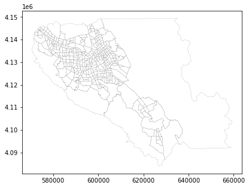
    


```python
#Access Demographics Data using CENSUS API

# define parameters of my API query
acs_total_pop = 'B01001_001E'  # total pop
acs_income = 'B07011_001E' #median income
acs_race_hispanic= 'B03003_003E' #hispanic pop
acs_race_not_hispanic= 'B03003_002E' #not hispanic
acs_race_white_alone= 'B03002_003E' #white alone
acs_race_black_alone= 'B03002_004E' #black alone
acs_race_asian_alone= 'B03002_006E' #asian alone
state = '06'  # CA
counties = '085'  # Santa Clara
year = 2019


# Access Tract Data Using my API key as an environmental variable
census_key = os.getenv("CENSUS_API")  

c = Census(census_key, year=year)
res = c.acs5.get((
    'NAME', acs_total_pop, acs_income, acs_race_hispanic, acs_race_not_hispanic, 
    acs_race_white_alone, acs_race_black_alone, acs_race_asian_alone), geo={
    'for': 'tract:*',
    'in': 'state:{} county:085'.format(states.CA.fips)
})

demo_tracts=pd.DataFrame(res)
demo_tracts
```


<div>
<style scoped>
    .dataframe tbody tr th:only-of-type {
        vertical-align: middle;
    }

    .dataframe tbody tr th {
        vertical-align: top;
    }

    .dataframe thead th {
        text-align: right;
    }
</style>
<table border="1" class="dataframe">
  <thead>
    <tr style="text-align: right;">
      <th></th>
      <th>NAME</th>
      <th>B01001_001E</th>
      <th>B07011_001E</th>
      <th>B03003_003E</th>
      <th>B03003_002E</th>
      <th>B03002_003E</th>
      <th>B03002_004E</th>
      <th>B03002_006E</th>
      <th>state</th>
      <th>county</th>
      <th>tract</th>
    </tr>
  </thead>
  <tbody>
    <tr>
      <th>0</th>
      <td>Census Tract 5079.04, Santa Clara County, Cali...</td>
      <td>3195.0</td>
      <td>93707.0</td>
      <td>105.0</td>
      <td>3090.0</td>
      <td>853.0</td>
      <td>0.0</td>
      <td>2097.0</td>
      <td>06</td>
      <td>085</td>
      <td>507904</td>
    </tr>
    <tr>
      <th>1</th>
      <td>Census Tract 5085.04, Santa Clara County, Cali...</td>
      <td>8604.0</td>
      <td>80673.0</td>
      <td>1363.0</td>
      <td>7241.0</td>
      <td>1584.0</td>
      <td>89.0</td>
      <td>4940.0</td>
      <td>06</td>
      <td>085</td>
      <td>508504</td>
    </tr>
    <tr>
      <th>2</th>
      <td>Census Tract 5085.05, Santa Clara County, Cali...</td>
      <td>4871.0</td>
      <td>87058.0</td>
      <td>416.0</td>
      <td>4455.0</td>
      <td>1941.0</td>
      <td>0.0</td>
      <td>2366.0</td>
      <td>06</td>
      <td>085</td>
      <td>508505</td>
    </tr>
    <tr>
      <th>3</th>
      <td>Census Tract 5087.04, Santa Clara County, Cali...</td>
      <td>7587.0</td>
      <td>72363.0</td>
      <td>1491.0</td>
      <td>6096.0</td>
      <td>1962.0</td>
      <td>303.0</td>
      <td>3587.0</td>
      <td>06</td>
      <td>085</td>
      <td>508704</td>
    </tr>
    <tr>
      <th>4</th>
      <td>Census Tract 5094.03, Santa Clara County, Cali...</td>
      <td>5779.0</td>
      <td>54388.0</td>
      <td>1980.0</td>
      <td>3799.0</td>
      <td>1707.0</td>
      <td>138.0</td>
      <td>1815.0</td>
      <td>06</td>
      <td>085</td>
      <td>509403</td>
    </tr>
    <tr>
      <th>...</th>
      <td>...</td>
      <td>...</td>
      <td>...</td>
      <td>...</td>
      <td>...</td>
      <td>...</td>
      <td>...</td>
      <td>...</td>
      <td>...</td>
      <td>...</td>
      <td>...</td>
    </tr>
    <tr>
      <th>367</th>
      <td>Census Tract 5120.27, Santa Clara County, Cali...</td>
      <td>4830.0</td>
      <td>49578.0</td>
      <td>1252.0</td>
      <td>3578.0</td>
      <td>1595.0</td>
      <td>188.0</td>
      <td>1507.0</td>
      <td>06</td>
      <td>085</td>
      <td>512027</td>
    </tr>
    <tr>
      <th>368</th>
      <td>Census Tract 5120.32, Santa Clara County, Cali...</td>
      <td>2997.0</td>
      <td>43405.0</td>
      <td>941.0</td>
      <td>2056.0</td>
      <td>1292.0</td>
      <td>48.0</td>
      <td>576.0</td>
      <td>06</td>
      <td>085</td>
      <td>512032</td>
    </tr>
    <tr>
      <th>369</th>
      <td>Census Tract 5120.33, Santa Clara County, Cali...</td>
      <td>9884.0</td>
      <td>54500.0</td>
      <td>2680.0</td>
      <td>7204.0</td>
      <td>3381.0</td>
      <td>391.0</td>
      <td>2780.0</td>
      <td>06</td>
      <td>085</td>
      <td>512033</td>
    </tr>
    <tr>
      <th>370</th>
      <td>Census Tract 5120.35, Santa Clara County, Cali...</td>
      <td>4924.0</td>
      <td>40169.0</td>
      <td>1489.0</td>
      <td>3435.0</td>
      <td>2088.0</td>
      <td>84.0</td>
      <td>1049.0</td>
      <td>06</td>
      <td>085</td>
      <td>512035</td>
    </tr>
    <tr>
      <th>371</th>
      <td>Census Tract 5043.14, Santa Clara County, Cali...</td>
      <td>4897.0</td>
      <td>43512.0</td>
      <td>875.0</td>
      <td>4022.0</td>
      <td>558.0</td>
      <td>67.0</td>
      <td>3275.0</td>
      <td>06</td>
      <td>085</td>
      <td>504314</td>
    </tr>
  </tbody>
</table>
<p>372 rows × 11 columns</p>
</div>


```python
#join demographics data with tracts, projection, and build GeoDataframe
demo_blocks = pd.merge(demo_tracts, santa_clara_tract_project, how='outer', left_on='tract', right_on='TRACTCE10')
demo_blocks_geo = gpd.GeoDataFrame(demo_blocks, geometry='geometry')
demo_blocks_geo_project = demo_blocks_geo.to_crs("epsg:26910")
demo_blocks_geo_project.plot(color='none', edgecolor='gray', linewidth=.2, figsize=(7,5))
```


    <AxesSubplot:>


    

    


```python
#Visualization 01:Demographics using normalized areas

#Normalization
demo_blocks_geo_project['area_sqmi'] = demo_blocks_geo_project.area / 3.861e-7
normalized_demographics= ['income_sqmi','hispanic_sqmi','not_hispanic_sqmi','white_sqmi','black_sqmi','asian_sqmi', 'total_pop_sqmi']
variables= ['B07011_001E','B03003_003E','B03003_002E','B03002_003E','B03002_004E','B03002_006E','B01001_001E']
colors= ['Reds','Greens','Oranges','Blues','Purples','Greys','OrRd']

for m in np.arange(7):
    demo_blocks_geo_project[normalized_demographics[m]]=demo_blocks_geo_project[variables[m]]/demo_blocks_geo_project['area_sqmi']

    
#Plotting

#income level
figure_income=demo_blocks_geo_project.plot(column=normalized_demographics[0],cmap=colors[0], edgecolor='gray', linewidth=.05,figsize=(10,10),
                             legend_kwds={'label': "level",
                                                  'orientation': "vertical",
                                                 'pad':0.05,
                                                 'shrink':0.6}, 
                             legend=True)
figure_income.set_title('income_level')


#Race
fig, ax = plt.subplots(3,2, figsize=(15,18))
x=0
for i in np.arange(3):
    for j in np.arange(2):
        x=x+1
        demo_blocks_geo_project.plot(ax=ax[i,j],column=normalized_demographics[x],cmap=colors[x], edgecolor='gray', linewidth=.05,legend=True,
                                     legend_kwds={'label': "level",
                                                  'orientation': "vertical",
                                                 'pad':0.05,
                                                 'shrink':0.8},
                                     vmin=0, 
                                     vmax=4.01e-9)
        ax[i,j].set_title(normalized_demographics[x].strip('_sqmi') + '_level')
        
```


    
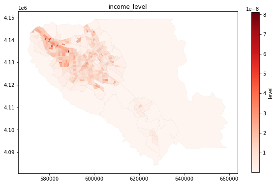
    


    
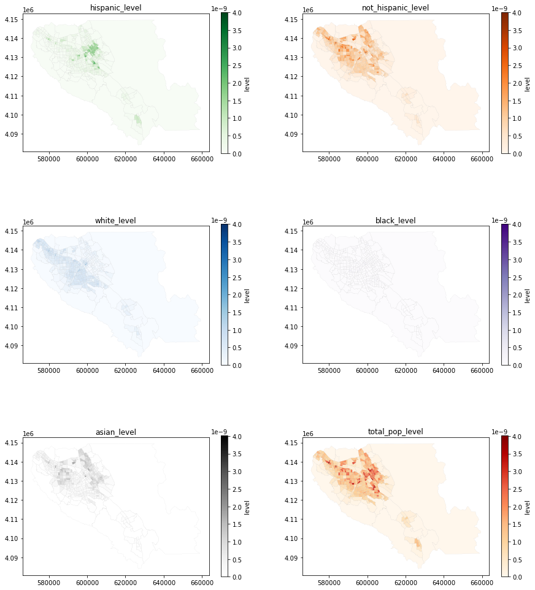
    


```python
#Turning Demographics into dot density

factor = 100
demo_blocks_geo_project[['total_pop_int','income_int','hispanic_int','not_hispanic_int','white_int','black_int','asian_int']] = round(demo_blocks_geo_project[['B01001_001E','B07011_001E','B03003_003E','B03003_002E','B03002_003E','B03002_004E','B03002_006E']] / factor).astype('int')
demo_blocks_geo_project[['minx','miny','maxx','maxy']]=demo_blocks_geo_project['geometry'].bounds[['minx','miny','maxx','maxy']]

#define a function generating random dots
def random_coordinates(row):
    results = []
    for var in ('total_pop_int','income_int','hispanic_int','not_hispanic_int','white_int','black_int','asian_int'):
        count = 0
        val = row[var]
        while count < val:
            x = random.uniform(row['minx'], row['maxx'])
            y = random.uniform(row['miny'], row['maxy'])
            pt = Point(x, y)
            if pt.within(row['geometry']):
                count += 1
                results.append([var, x, y])
    return pd.DataFrame(results, columns=('variable', 'x', 'y'))

results = demo_blocks_geo_project.apply(random_coordinates, axis=1)
results = pd.concat(results.tolist(), ignore_index=True)
results.head()
```


<div>
<style scoped>
    .dataframe tbody tr th:only-of-type {
        vertical-align: middle;
    }

    .dataframe tbody tr th {
        vertical-align: top;
    }

    .dataframe thead th {
        text-align: right;
    }
</style>
<table border="1" class="dataframe">
  <thead>
    <tr style="text-align: right;">
      <th></th>
      <th>variable</th>
      <th>x</th>
      <th>y</th>
    </tr>
  </thead>
  <tbody>
    <tr>
      <th>0</th>
      <td>total_pop_int</td>
      <td>588527.281275</td>
      <td>4.128996e+06</td>
    </tr>
    <tr>
      <th>1</th>
      <td>total_pop_int</td>
      <td>588408.046028</td>
      <td>4.128995e+06</td>
    </tr>
    <tr>
      <th>2</th>
      <td>total_pop_int</td>
      <td>588452.353728</td>
      <td>4.128969e+06</td>
    </tr>
    <tr>
      <th>3</th>
      <td>total_pop_int</td>
      <td>588338.188191</td>
      <td>4.128576e+06</td>
    </tr>
    <tr>
      <th>4</th>
      <td>total_pop_int</td>
      <td>588193.813124</td>
      <td>4.128871e+06</td>
    </tr>
  </tbody>
</table>
</div>


```python
#Create Geodataframes
demo_points = gpd.GeoDataFrame(
    results, geometry=gpd.points_from_xy(results.x, results.y))
demo_points_projected=demo_points.set_crs("epsg:26910")

total_pop_points=demo_points_projected.loc[demo_points_projected['variable']=='total_pop_int']
income_points=demo_points_projected.loc[demo_points_projected['variable']=='income_int']
hispanic_points=demo_points_projected.loc[demo_points_projected['variable']=='hispanic_int']
not_hispanic_points=demo_points_projected.loc[demo_points_projected['variable']=='not_hispanic_int']
white_points=demo_points_projected.loc[demo_points_projected['variable']=='white_int']
black_points=demo_points_projected.loc[demo_points_projected['variable']=='black_int']
asian_points=demo_points_projected.loc[demo_points_projected['variable']=='asian_int']
```


```python
hispanic_points.to_csv('hispanic_points.csv')
not_hispanic_points.to_csv('not_hispanic_points.csv')
total_pop_points.to_csv('total_pop_points.csv')
```


```python
#Plotting
#income level
fig, ax = plt.subplots(figsize=(10,10))
demo_blocks_geo_project.plot(ax=ax, color='none', edgecolor='gray', linewidth=.05)
figure_income_points=income_points.plot(ax=ax, color='r', markersize=.0002, alpha=0.2)
figure_income_points.set_title('income_level_dot_density')

#Race
point_figures=[income_points, hispanic_points, not_hispanic_points, white_points, black_points, asian_points, total_pop_points]
fig, ax = plt.subplots(3,2, figsize=(15,18))
x=0
for i in np.arange(3):
    for j in np.arange(2):
        x=x+1
        demo_blocks_geo_project.plot(ax=ax[i,j], color='none', edgecolor='gray', linewidth=.05)
        point_figures[x].plot(ax=ax[i,j],color='r', markersize=.01, alpha=0.2)
        ax[i,j].set_title(normalized_demographics[x].strip('_sqmi') + '_level_dot_density')
```


    
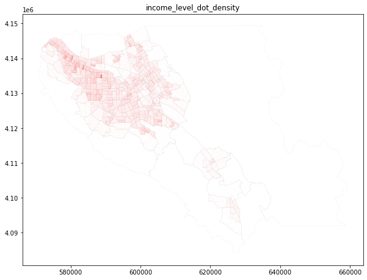
    


    
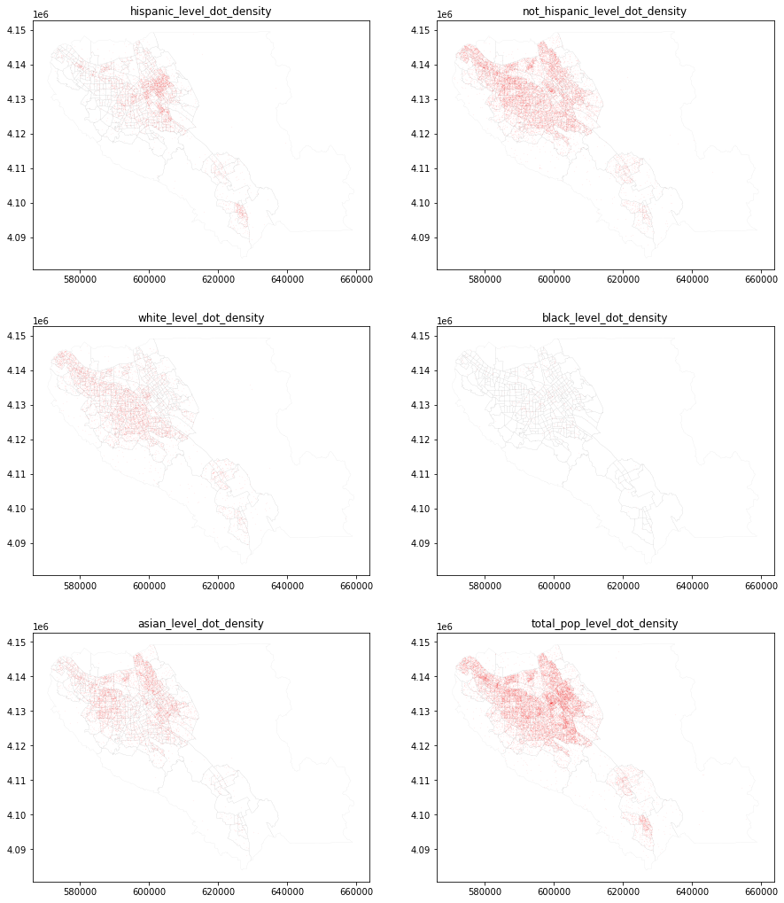
    


```python
#Plotting using Interpolate
#Income
fig, ax = plt.subplots(figsize=(10,10))
demo_blocks_geo_project.plot(ax=ax, color='none', edgecolor='gray', linewidth=.1)
figure_income_interpolate=sns.kdeplot(
    x=income_points['geometry'].x, y=income_points['geometry'].y,
    cmap='turbo', fill=True, alpha=0.6,legend=True, cbar=True,
                   cbar_kws={'shrink':0.6,'label': "level",'orientation': "vertical",'pad':0.05})
figure_income_interpolate.set_title('income_level_interpolate')
```


    Text(0.5, 1.0, 'income_level_interpolate')


    
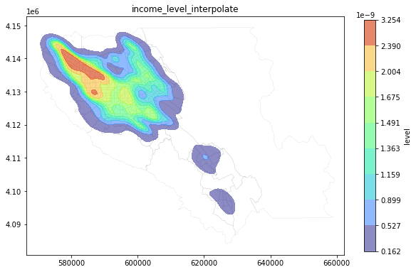
    


```python
#Race
fig, ax = plt.subplots(3,2, figsize=(15,18))
x=0
for i in np.arange(3):
    for j in np.arange(2):
        x=x+1
        demo_blocks_geo_project.plot(ax=ax[i,j], color='none', edgecolor='gray', linewidth=.1)
        sns.kdeplot(ax=ax[i,j],x=point_figures[x]['geometry'].x, y=point_figures[x]['geometry'].y, cmap='turbo', fill=True, alpha=0.5,cbar=True,
                   cbar_kws={'shrink':0.8,'label': "level",'orientation': "vertical",'pad':0.05})
        ax[i,j].set_title(normalized_demographics[x].strip('_sqmi') + '_level_interpolate')
```


    
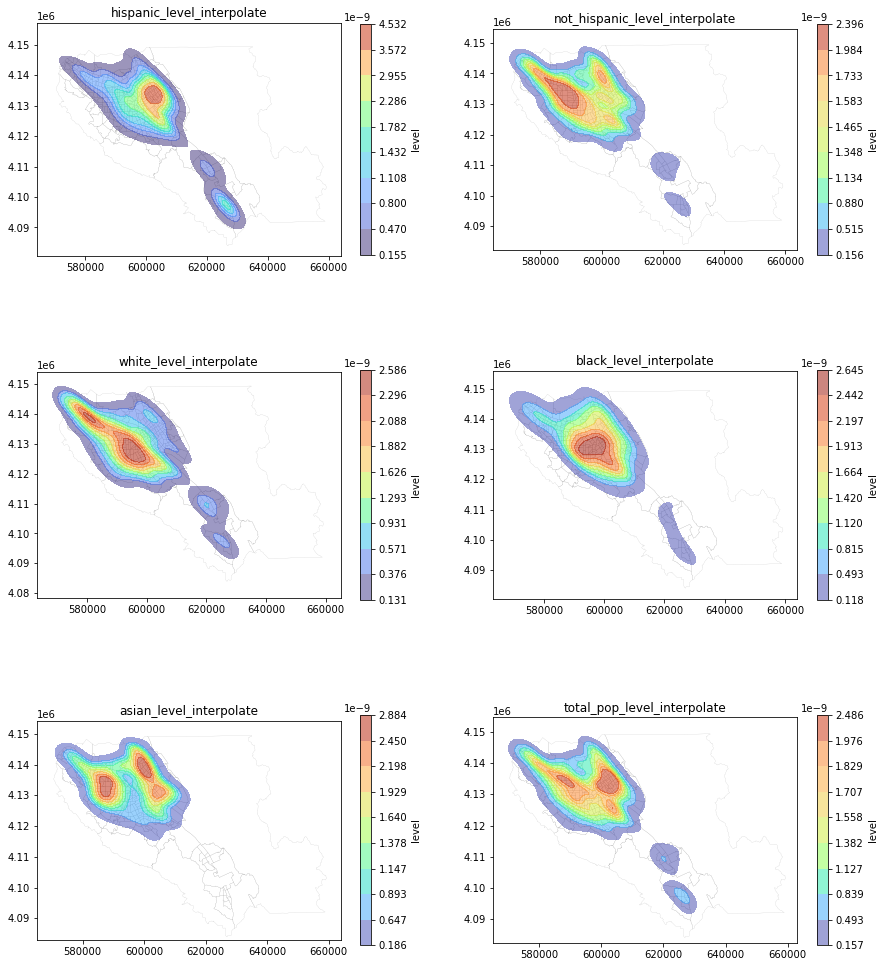
    


  


#### 2.Crimes (Geocoding)


  


```python
#Geocoding Crimes
#Read Crime Data from APIs
crimes_url='https://data.sccgov.org/resource/n9u6-aijz.json'
crimes_response=requests.get(crimes_url)
crimes_all=pd.DataFrame.from_dict(crimes_response.json())
crimes_all['address']=crimes_all['address_1']+', '+crimes_all['city']+ ', California'
crimes_address=crimes_all['address'].to_list()
```


```python
#Geocoding
with open("mapbox_api_key.json", 'r') as f:
    key_file = f.read()

my_api_key = json.loads(key_file)['key']
geocoder = Geocoder(access_token=my_api_key)

crime = pd.DataFrame(index=[],columns=['address','lat','lon'])
addrs=crimes_address

for i in range(len(addrs)):
    geoadress=geocoder.forward(str(addrs[i]), limit = 1).geojson()['features'][0]['geometry']['coordinates']
    crime.loc[i, 'address']=addrs[i]
    crime.loc[i, 'lon']=geoadress[0]
    crime.loc[i, 'lat']=geoadress[1]

crime_cleaned=crime.loc[crime['lon']<-121.1].loc[crime['lon']>-122.2].loc[crime['lat']<37.5].loc[crime['lat']>36.8]
```


```python
crime_cleaned.reset_index()
```


<div>
<style scoped>
    .dataframe tbody tr th:only-of-type {
        vertical-align: middle;
    }

    .dataframe tbody tr th {
        vertical-align: top;
    }

    .dataframe thead th {
        text-align: right;
    }
</style>
<table border="1" class="dataframe">
  <thead>
    <tr style="text-align: right;">
      <th></th>
      <th>index</th>
      <th>address</th>
      <th>lat</th>
      <th>lon</th>
    </tr>
  </thead>
  <tbody>
    <tr>
      <th>0</th>
      <td>0</td>
      <td>25600 Block W FREMONT RD, Santa Clara County, ...</td>
      <td>37.36</td>
      <td>-121.97</td>
    </tr>
    <tr>
      <th>1</th>
      <td>1</td>
      <td>TENNANT AV (D2) , Santa Clara County, California</td>
      <td>37.24889</td>
      <td>-121.774087</td>
    </tr>
    <tr>
      <th>2</th>
      <td>2</td>
      <td>12300 Block BLOCK EL MONTE RD, Santa Clara Cou...</td>
      <td>37.3571</td>
      <td>-122.12677</td>
    </tr>
    <tr>
      <th>3</th>
      <td>3</td>
      <td>CONDIT RD , Santa Clara County, California</td>
      <td>37.13395</td>
      <td>-121.632425</td>
    </tr>
    <tr>
      <th>4</th>
      <td>4</td>
      <td>14000 Block LUCIAN AV, Santa Clara County, Cal...</td>
      <td>37.36</td>
      <td>-121.97</td>
    </tr>
    <tr>
      <th>...</th>
      <td>...</td>
      <td>...</td>
      <td>...</td>
      <td>...</td>
    </tr>
    <tr>
      <th>991</th>
      <td>995</td>
      <td>1400 Block E MIDDLE AV, Santa Clara County, Ca...</td>
      <td>37.10532</td>
      <td>-121.60681</td>
    </tr>
    <tr>
      <th>992</th>
      <td>996</td>
      <td>N 2ND ST (D2) , Santa Clara County, California</td>
      <td>37.3272</td>
      <td>-121.882875</td>
    </tr>
    <tr>
      <th>993</th>
      <td>997</td>
      <td>700 Block BLOCK S ABEL ST, Santa Clara County,...</td>
      <td>37.36</td>
      <td>-121.97</td>
    </tr>
    <tr>
      <th>994</th>
      <td>998</td>
      <td>95 Block BLOCK UNIVERSITY AV, Santa Clara Coun...</td>
      <td>37.36</td>
      <td>-121.97</td>
    </tr>
    <tr>
      <th>995</th>
      <td>999</td>
      <td>COLUMBET AV , Santa Clara County, California</td>
      <td>37.08956</td>
      <td>-121.59105</td>
    </tr>
  </tbody>
</table>
<p>996 rows × 4 columns</p>
</div>


```python
#Turn LAT/LON to X/Y
lon_list=crime_cleaned['lon'].to_list()
lat_list=crime_cleaned['lat'].to_list()

j=0
xy_coor = []
for i in lon_list:
    xy_coor.append(utm.from_latlon(lat_list[j],i))
    j=j+1

xy=pd.DataFrame(xy_coor)
xy=xy.rename(columns={0:'x',1:'y',2:'zone'})
xy.head()
```


<div>
<style scoped>
    .dataframe tbody tr th:only-of-type {
        vertical-align: middle;
    }

    .dataframe tbody tr th {
        vertical-align: top;
    }

    .dataframe thead th {
        text-align: right;
    }
</style>
<table border="1" class="dataframe">
  <thead>
    <tr style="text-align: right;">
      <th></th>
      <th>x</th>
      <th>y</th>
      <th>zone</th>
      <th>3</th>
    </tr>
  </thead>
  <tbody>
    <tr>
      <th>0</th>
      <td>591212.787370</td>
      <td>4.135307e+06</td>
      <td>10</td>
      <td>S</td>
    </tr>
    <tr>
      <th>1</th>
      <td>608722.556775</td>
      <td>4.123187e+06</td>
      <td>10</td>
      <td>S</td>
    </tr>
    <tr>
      <th>2</th>
      <td>577332.510799</td>
      <td>4.134845e+06</td>
      <td>10</td>
      <td>S</td>
    </tr>
    <tr>
      <th>3</th>
      <td>621470.819604</td>
      <td>4.110607e+06</td>
      <td>10</td>
      <td>S</td>
    </tr>
    <tr>
      <th>4</th>
      <td>591212.787370</td>
      <td>4.135307e+06</td>
      <td>10</td>
      <td>S</td>
    </tr>
  </tbody>
</table>
</div>


```python
#Build Geodataframe
crime_points = gpd.GeoDataFrame(
    xy, geometry=gpd.points_from_xy(xy.x, xy.y))
crime_points_projected=crime_points.set_crs("epsg:26910")
```


```python
crime_points.to_csv('crimes.csv')
```


```python
#Plotting
fig, ax = plt.subplots(figsize=(10,10))
demo_blocks_geo_project.plot(ax=ax, color='none', edgecolor='gray', linewidth=.1)
figure_crime_points=crime_points_projected.plot(ax=ax, color='r', markersize=2, alpha=0.2)
figure_crime_points.set_title('crime_points')
```


    Text(0.5, 1.0, 'crime_points')


    

    


```python
#Interpolate
fig, ax = plt.subplots(figsize=(10,10))
demo_blocks_geo_project.plot(ax=ax, color='none', edgecolor='gray', linewidth=.1)
figure_crime_interpolate=sns.kdeplot(
    x=crime_points_projected['geometry'].x, y=crime_points_projected['geometry'].y,
    cmap='turbo', fill=True, alpha=0.6,legend=True, cbar=True,vmax=2.01e-8,
                   cbar_kws={'shrink':0.6,'label': "level",'orientation': "vertical",'pad':0.05})
figure_crime_interpolate.set_title('crime_level_interpolate')
```


    Text(0.5, 1.0, 'crime_level_interpolate')


    
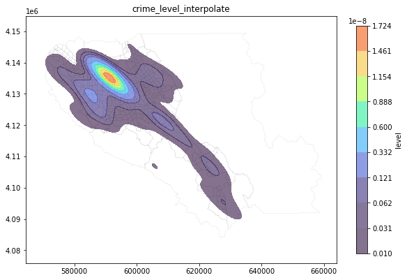
    


  

#### 3.Housing Prices (Web Scraping + Geocoding)

  


```python
#Scrape From Realtor.com using API
url="https://api.webscrapingapi.com/v1"
page=[]
for k in np.arange(30):
    pagek='https://www.realtor.com/realestateandhomes-search/Santa-Clara-County_CA'+'/pg-'+k.astype('str')
    page.append(pagek)

responses=[]
for m in np.arange(30):
    reponsem='reponse'+m.astype('str')
    responses.append(reponsem)
    
contents=[]
for n in np.arange(30):
    content='content'+n.astype('str')
    contents.append(content)
    
for i in np.arange(30):
    params={
    "api_key": "yKUskmBuReXD3E3vWzcLf5sqsTE1jaIr",
    "url": page[i]}
    
    responses[i] = requests.request("GET", url, params=params)
    contents[i] = responses[i].text

    
prices=[]
beds=[]
baths=[]
sizes=[]
addresses=[]

soups=[]
for o in np.arange(30):
    soupo='soup'+o.astype('str')
    soups.append(soupo)

for k in np.arange(30):
    soups[k] = BeautifulSoup(contents[k], features='html.parser')

for soupi in soups:
    for element in soupi.findAll('li', attrs={'class': 'component_property-card'}):
        price = element.find('span', attrs={'data-label': 'pc-price'})
        bed = element.find('li', attrs={'data-label': 'pc-meta-beds'})
        bath = element.find('li', attrs={'data-label': 'pc-meta-baths'})
        size = element.find('li', attrs={'data-label': 'pc-meta-sqft'})
        address = element.find('div', attrs={'data-label': 'pc-address'})
        
        if bed and bath:
            nr_beds = bed.find('span', attrs={'data-label': 'meta-value'})
            nr_baths = bath.find('span', attrs={'data-label': 'meta-value'})
        
        if nr_beds and float(nr_beds.text) >= 1:
            beds.append(nr_beds.text)
            baths.append(nr_baths.text)

            if price and price.text:
                prices.append(price.text)
            else:
                    prices.append('No display data')
            
            if size and size.text:
                sizes.append(size.text)
            else:
                sizes.append('No display data')
                
            if address and address.text:
                addresses.append(address.text)
            else:
                addresses.append('No display data')
```


```python
df3 = pd.DataFrame({'Address': addresses, 'Price': prices, 'Beds': beds, 'Baths': baths, 'Sizes': sizes})
```


```python
housing_cleaned=df3[(df3['Address']!= 'No display data')&(df3['Price']!= 'No display data')&(df3['Sizes']!= 'No display data')]
housing_cleaned.to_csv('housing_santa_clara_final.csv')
housing_cleaned
```


<div>
<style scoped>
    .dataframe tbody tr th:only-of-type {
        vertical-align: middle;
    }

    .dataframe tbody tr th {
        vertical-align: top;
    }

    .dataframe thead th {
        text-align: right;
    }
</style>
<table border="1" class="dataframe">
  <thead>
    <tr style="text-align: right;">
      <th></th>
      <th>Address</th>
      <th>Price</th>
      <th>Beds</th>
      <th>Baths</th>
      <th>Sizes</th>
    </tr>
  </thead>
  <tbody>
    <tr>
      <th>0</th>
      <td>693 Barrett Ave, Morgan Hill, CA 95037</td>
      <td>$560,000</td>
      <td>4</td>
      <td>2.5</td>
      <td>1,897sqft</td>
    </tr>
    <tr>
      <th>1</th>
      <td>133 Mountain Springs Dr Unit 133, San Jose, CA...</td>
      <td>$375,000</td>
      <td>3</td>
      <td>2</td>
      <td>1,658sqft</td>
    </tr>
    <tr>
      <th>2</th>
      <td>7951 Carmel St, Gilroy, CA 95020</td>
      <td>$729,000</td>
      <td>3</td>
      <td>2</td>
      <td>1,528sqft</td>
    </tr>
    <tr>
      <th>4</th>
      <td>854 N 12th St, San Jose, CA 95112</td>
      <td>$1,050,000</td>
      <td>2</td>
      <td>2</td>
      <td>1,300sqft</td>
    </tr>
    <tr>
      <th>5</th>
      <td>1849 Forest Ct, Milpitas, CA 95035</td>
      <td>$998,888</td>
      <td>3</td>
      <td>2</td>
      <td>1,215sqft</td>
    </tr>
    <tr>
      <th>...</th>
      <td>...</td>
      <td>...</td>
      <td>...</td>
      <td>...</td>
      <td>...</td>
    </tr>
    <tr>
      <th>1338</th>
      <td>312 Blairbeth Dr, San Jose, CA 95119</td>
      <td>$1,165,000</td>
      <td>3</td>
      <td>1.5</td>
      <td>1,014sqft</td>
    </tr>
    <tr>
      <th>1339</th>
      <td>2307 Newhall St, San Jose, CA 95128</td>
      <td>$1,199,888</td>
      <td>2</td>
      <td>2</td>
      <td>1,000sqft</td>
    </tr>
    <tr>
      <th>1340</th>
      <td>465 McCamish Ave, San Jose, CA 95123</td>
      <td>$1,398,000</td>
      <td>5</td>
      <td>3</td>
      <td>1,380sqft</td>
    </tr>
    <tr>
      <th>1341</th>
      <td>2170 Cabrillo Ave, Santa Clara, CA 95050</td>
      <td>$1,475,000</td>
      <td>3</td>
      <td>2</td>
      <td>1,181sqft</td>
    </tr>
    <tr>
      <th>1342</th>
      <td>752 Menker Ave, San Jose, CA 95128</td>
      <td>$1,398,000</td>
      <td>3</td>
      <td>2</td>
      <td>1,206sqft</td>
    </tr>
  </tbody>
</table>
<p>1159 rows × 5 columns</p>
</div>


```python
#Geocoding 02
housing_address=housing_cleaned['Address'].to_list()

with open("mapbox_api_key.json", 'r') as f:
    key_file = f.read()

my_api_key = json.loads(key_file)['key']
geocoder = Geocoder(access_token=my_api_key)

housing = pd.DataFrame(index=[],columns=['address','lat','lon'])
addrs=housing_address

for i in range(len(addrs)):
    geoadress=geocoder.forward(str(addrs[i]), limit = 1).geojson()['features'][0]['geometry']['coordinates']
    housing.loc[i, 'address']=addrs[i]
    housing.loc[i, 'lon']=geoadress[0]
    housing.loc[i, 'lat']=geoadress[1]

housing_geocoded=housing.loc[housing['lon']<-121.1].loc[housing['lon']>-122.2].loc[housing['lat']<37.5].loc[housing['lat']>36.8]
```


```python
housing_geocoded.to_csv('housing_with_coor.csv')
```


```python
housing_coor=pd.read_csv('housing_with_coor.csv')
housing_coor.reset_index
```


    <bound method DataFrame.reset_index of       Unnamed: 0                                            address  \
    0              0             693 Barrett Ave, Morgan Hill, CA 95037   
    1              1  133 Mountain Springs Dr Unit 133, San Jose, CA...   
    2              2                   7951 Carmel St, Gilroy, CA 95020   
    3              3                  854 N 12th St, San Jose, CA 95112   
    4              4                 1849 Forest Ct, Milpitas, CA 95035   
    ...          ...                                                ...   
    1154        1154               312 Blairbeth Dr, San Jose, CA 95119   
    1155        1155                2307 Newhall St, San Jose, CA 95128   
    1156        1156               465 McCamish Ave, San Jose, CA 95123   
    1157        1157           2170 Cabrillo Ave, Santa Clara, CA 95050   
    1158        1158                 752 Menker Ave, San Jose, CA 95128   
    
                lat         lon  
    0     37.121650 -121.633860  
    1     37.280390 -121.864500  
    2     37.012880 -121.580020  
    3     37.358100 -121.891030  
    4     37.404010 -121.907890  
    ...         ...         ...  
    1154  37.223995 -121.787512  
    1155  37.337945 -121.943985  
    1156  37.234735 -121.818452  
    1157  37.358600 -121.962480  
    1158  37.313195 -121.921097  
    
    [1159 rows x 4 columns]>


```python
#Turn LAT/LON to X/Y
housing_lon_list=housing_coor['lon'].to_list()
houisng_lat_list=housing_coor['lat'].to_list()

o=0
housing_xy_coor = []
for i in housing_lon_list:
    housing_xy_coor.append(utm.from_latlon(houisng_lat_list[o],i))
    o=o+1

housing_xy=pd.DataFrame(housing_xy_coor)
housing_xy=housing_xy.rename(columns={0:'x',1:'y',2:'zone'})
housing_xy.head()
```


<div>
<style scoped>
    .dataframe tbody tr th:only-of-type {
        vertical-align: middle;
    }

    .dataframe tbody tr th {
        vertical-align: top;
    }

    .dataframe thead th {
        text-align: right;
    }
</style>
<table border="1" class="dataframe">
  <thead>
    <tr style="text-align: right;">
      <th></th>
      <th>x</th>
      <th>y</th>
      <th>zone</th>
      <th>3</th>
    </tr>
  </thead>
  <tbody>
    <tr>
      <th>0</th>
      <td>621362.996494</td>
      <td>4.109241e+06</td>
      <td>10</td>
      <td>S</td>
    </tr>
    <tr>
      <th>1</th>
      <td>600661.902772</td>
      <td>4.126582e+06</td>
      <td>10</td>
      <td>S</td>
    </tr>
    <tr>
      <th>2</th>
      <td>626326.515128</td>
      <td>4.097244e+06</td>
      <td>10</td>
      <td>S</td>
    </tr>
    <tr>
      <th>3</th>
      <td>598208.763159</td>
      <td>4.135176e+06</td>
      <td>10</td>
      <td>S</td>
    </tr>
    <tr>
      <th>4</th>
      <td>596656.667605</td>
      <td>4.140252e+06</td>
      <td>10</td>
      <td>S</td>
    </tr>
  </tbody>
</table>
</div>


```python
#Combine Dataframes
housing_prices=pd.read_csv('housing_santa_clara_final.csv')
housing_merged=pd.merge(housing_prices,housing_xy,how='outer',left_index=True, right_index=True)

#Data Cleaning
housing_merged['price_num']=housing_merged['Price'].str.replace('$','',regex=True).str.replace('From','',regex=True).str.replace(',','',regex=True).astype(int)
housing_merged['Beds_num']=housing_merged['Beds'].astype(str).str.replace('+','',regex=True).astype(float)
housing_merged['Baths_num']=housing_merged['Baths'].astype(str).str.replace('+','',regex=True).astype(float)
housing_merged['Size_num']=housing_merged['Sizes'].str.replace(',','',regex=True).str.replace('sqft','',regex=True).astype(float)
housing_merged.to_csv('housing_merged.csv')
housing_merged
```


<div>
<style scoped>
    .dataframe tbody tr th:only-of-type {
        vertical-align: middle;
    }

    .dataframe tbody tr th {
        vertical-align: top;
    }

    .dataframe thead th {
        text-align: right;
    }
</style>
<table border="1" class="dataframe">
  <thead>
    <tr style="text-align: right;">
      <th></th>
      <th>Unnamed: 0</th>
      <th>Address</th>
      <th>Price</th>
      <th>Beds</th>
      <th>Baths</th>
      <th>Sizes</th>
      <th>x</th>
      <th>y</th>
      <th>zone</th>
      <th>3</th>
      <th>price_num</th>
      <th>Beds_num</th>
      <th>Baths_num</th>
      <th>Size_num</th>
    </tr>
  </thead>
  <tbody>
    <tr>
      <th>0</th>
      <td>0</td>
      <td>693 Barrett Ave, Morgan Hill, CA 95037</td>
      <td>$560,000</td>
      <td>4</td>
      <td>2.5</td>
      <td>1,897sqft</td>
      <td>621362.996494</td>
      <td>4.109241e+06</td>
      <td>10</td>
      <td>S</td>
      <td>560000</td>
      <td>4.0</td>
      <td>2.5</td>
      <td>1897.0</td>
    </tr>
    <tr>
      <th>1</th>
      <td>1</td>
      <td>133 Mountain Springs Dr Unit 133, San Jose, CA...</td>
      <td>$375,000</td>
      <td>3</td>
      <td>2</td>
      <td>1,658sqft</td>
      <td>600661.902772</td>
      <td>4.126582e+06</td>
      <td>10</td>
      <td>S</td>
      <td>375000</td>
      <td>3.0</td>
      <td>2.0</td>
      <td>1658.0</td>
    </tr>
    <tr>
      <th>2</th>
      <td>2</td>
      <td>7951 Carmel St, Gilroy, CA 95020</td>
      <td>$729,000</td>
      <td>3</td>
      <td>2</td>
      <td>1,528sqft</td>
      <td>626326.515128</td>
      <td>4.097244e+06</td>
      <td>10</td>
      <td>S</td>
      <td>729000</td>
      <td>3.0</td>
      <td>2.0</td>
      <td>1528.0</td>
    </tr>
    <tr>
      <th>3</th>
      <td>4</td>
      <td>854 N 12th St, San Jose, CA 95112</td>
      <td>$1,050,000</td>
      <td>2</td>
      <td>2</td>
      <td>1,300sqft</td>
      <td>598208.763159</td>
      <td>4.135176e+06</td>
      <td>10</td>
      <td>S</td>
      <td>1050000</td>
      <td>2.0</td>
      <td>2.0</td>
      <td>1300.0</td>
    </tr>
    <tr>
      <th>4</th>
      <td>5</td>
      <td>1849 Forest Ct, Milpitas, CA 95035</td>
      <td>$998,888</td>
      <td>3</td>
      <td>2</td>
      <td>1,215sqft</td>
      <td>596656.667605</td>
      <td>4.140252e+06</td>
      <td>10</td>
      <td>S</td>
      <td>998888</td>
      <td>3.0</td>
      <td>2.0</td>
      <td>1215.0</td>
    </tr>
    <tr>
      <th>...</th>
      <td>...</td>
      <td>...</td>
      <td>...</td>
      <td>...</td>
      <td>...</td>
      <td>...</td>
      <td>...</td>
      <td>...</td>
      <td>...</td>
      <td>...</td>
      <td>...</td>
      <td>...</td>
      <td>...</td>
      <td>...</td>
    </tr>
    <tr>
      <th>1154</th>
      <td>1338</td>
      <td>312 Blairbeth Dr, San Jose, CA 95119</td>
      <td>$1,165,000</td>
      <td>3</td>
      <td>1.5</td>
      <td>1,014sqft</td>
      <td>607567.302067</td>
      <td>4.120410e+06</td>
      <td>10</td>
      <td>S</td>
      <td>1165000</td>
      <td>3.0</td>
      <td>1.5</td>
      <td>1014.0</td>
    </tr>
    <tr>
      <th>1155</th>
      <td>1339</td>
      <td>2307 Newhall St, San Jose, CA 95128</td>
      <td>$1,199,888</td>
      <td>2</td>
      <td>2</td>
      <td>1,000sqft</td>
      <td>593544.005907</td>
      <td>4.132886e+06</td>
      <td>10</td>
      <td>S</td>
      <td>1199888</td>
      <td>2.0</td>
      <td>2.0</td>
      <td>1000.0</td>
    </tr>
    <tr>
      <th>1156</th>
      <td>1340</td>
      <td>465 McCamish Ave, San Jose, CA 95123</td>
      <td>$1,398,000</td>
      <td>5</td>
      <td>3</td>
      <td>1,380sqft</td>
      <td>604807.448551</td>
      <td>4.121567e+06</td>
      <td>10</td>
      <td>S</td>
      <td>1398000</td>
      <td>5.0</td>
      <td>3.0</td>
      <td>1380.0</td>
    </tr>
    <tr>
      <th>1157</th>
      <td>1341</td>
      <td>2170 Cabrillo Ave, Santa Clara, CA 95050</td>
      <td>$1,475,000</td>
      <td>3</td>
      <td>2</td>
      <td>1,181sqft</td>
      <td>591880.455486</td>
      <td>4.135159e+06</td>
      <td>10</td>
      <td>S</td>
      <td>1475000</td>
      <td>3.0</td>
      <td>2.0</td>
      <td>1181.0</td>
    </tr>
    <tr>
      <th>1158</th>
      <td>1342</td>
      <td>752 Menker Ave, San Jose, CA 95128</td>
      <td>$1,398,000</td>
      <td>3</td>
      <td>2</td>
      <td>1,206sqft</td>
      <td>595602.891193</td>
      <td>4.130163e+06</td>
      <td>10</td>
      <td>S</td>
      <td>1398000</td>
      <td>3.0</td>
      <td>2.0</td>
      <td>1206.0</td>
    </tr>
  </tbody>
</table>
<p>1159 rows × 14 columns</p>
</div>


```python
#Build Geodataframe
housing_points = gpd.GeoDataFrame(
    housing_merged, geometry=gpd.points_from_xy(housing_merged.x, housing_merged.y))
housing_points_projected=housing_points.set_crs("epsg:26910")
```


```python
fig, ax = plt.subplots(figsize=(10,10))
demo_blocks_geo_project.plot(ax=ax, color='none', edgecolor='gray', linewidth=.1)
housing_points_projected_figure=housing_points_projected.plot(ax=ax, color='r', markersize=2, alpha=0.2)
housing_points_projected_figure.set_title('housing_points')
```


    Text(0.5, 1.0, 'housing_points')


    

    


  

#### 4.Parks (Shapefiles)

  


```python
#read park shapefiles
park=gpd.read_file("park.shp")
park_project=park.to_crs("epsg:26910")

fig, ax = plt.subplots(figsize=(10,10))
demo_blocks_geo_project.plot(ax=ax, color='none', edgecolor='gray', linewidth=.1)
park_project_figure=park_project.plot(ax=ax, color='r', markersize=2, alpha=0.2)
park_project_figure.set_title('park_points')
```


    Text(0.5, 1.0, 'park_points')


    
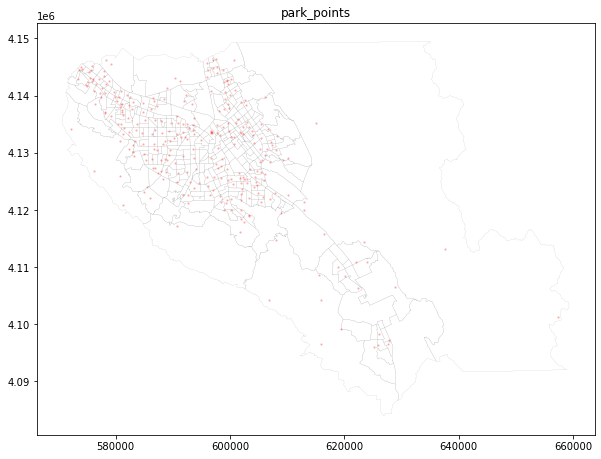
    


```python
park_project
```


<div>
<style scoped>
    .dataframe tbody tr th:only-of-type {
        vertical-align: middle;
    }

    .dataframe tbody tr th {
        vertical-align: top;
    }

    .dataframe thead th {
        text-align: right;
    }
</style>
<table border="1" class="dataframe">
  <thead>
    <tr style="text-align: right;">
      <th></th>
      <th>address</th>
      <th>city</th>
      <th>editor</th>
      <th>date_lastu</th>
      <th>time_lastu</th>
      <th>latitude</th>
      <th>longitude</th>
      <th>notes</th>
      <th>objectid</th>
      <th>placename</th>
      <th>placetype</th>
      <th>poicatagor</th>
      <th>source</th>
      <th>symbologys</th>
      <th>uniqueid</th>
      <th>zip</th>
      <th>geometry</th>
    </tr>
  </thead>
  <tbody>
    <tr>
      <th>0</th>
      <td>None</td>
      <td>None</td>
      <td>ISD - GIS</td>
      <td>2011-09-14</td>
      <td>00:00:00.000</td>
      <td>37.345192</td>
      <td>-121.827989</td>
      <td>Not Determined</td>
      <td>78.0</td>
      <td>Cassell Park</td>
      <td>Park</td>
      <td>Leisure</td>
      <td>ESRI</td>
      <td>&lt;Null&gt;</td>
      <td>832010POS</td>
      <td>None</td>
      <td>POINT (603809.713 4133810.890)</td>
    </tr>
    <tr>
      <th>1</th>
      <td>None</td>
      <td>None</td>
      <td>ISD - GIS</td>
      <td>2011-09-14</td>
      <td>00:00:00.000</td>
      <td>37.420058</td>
      <td>-121.873051</td>
      <td>Not Determined</td>
      <td>249.0</td>
      <td>Sinnott Park</td>
      <td>Park</td>
      <td>Leisure</td>
      <td>ESRI</td>
      <td>&lt;Null&gt;</td>
      <td>2542010POS</td>
      <td>None</td>
      <td>POINT (599719.053 4142068.434)</td>
    </tr>
    <tr>
      <th>2</th>
      <td>None</td>
      <td>None</td>
      <td>ISD - GIS</td>
      <td>2011-09-14</td>
      <td>00:00:00.000</td>
      <td>37.453678</td>
      <td>-122.104850</td>
      <td>Not Determined</td>
      <td>68.0</td>
      <td>Byxbee Recreation Area</td>
      <td>Park</td>
      <td>Leisure</td>
      <td>ESRI</td>
      <td>&lt;Null&gt;</td>
      <td>732010POS</td>
      <td>None</td>
      <td>POINT (579172.190 4145578.295)</td>
    </tr>
    <tr>
      <th>3</th>
      <td>None</td>
      <td>None</td>
      <td>ISD - GIS</td>
      <td>2011-09-14</td>
      <td>00:00:00.000</td>
      <td>37.388243</td>
      <td>-121.874145</td>
      <td>Not Determined</td>
      <td>117.0</td>
      <td>Flickering Park</td>
      <td>Park</td>
      <td>Leisure</td>
      <td>ESRI</td>
      <td>&lt;Null&gt;</td>
      <td>1222010POS</td>
      <td>None</td>
      <td>POINT (599664.361 4138537.476)</td>
    </tr>
    <tr>
      <th>4</th>
      <td>None</td>
      <td>None</td>
      <td>ISD - GIS</td>
      <td>2011-09-14</td>
      <td>00:00:00.000</td>
      <td>37.319050</td>
      <td>-122.021297</td>
      <td>Not Determined</td>
      <td>284.0</td>
      <td>Wilson Park</td>
      <td>Park</td>
      <td>Leisure</td>
      <td>ESRI</td>
      <td>&lt;Null&gt;</td>
      <td>2892010POS</td>
      <td>None</td>
      <td>POINT (586717.290 4130715.624)</td>
    </tr>
    <tr>
      <th>...</th>
      <td>...</td>
      <td>...</td>
      <td>...</td>
      <td>...</td>
      <td>...</td>
      <td>...</td>
      <td>...</td>
      <td>...</td>
      <td>...</td>
      <td>...</td>
      <td>...</td>
      <td>...</td>
      <td>...</td>
      <td>...</td>
      <td>...</td>
      <td>...</td>
      <td>...</td>
    </tr>
    <tr>
      <th>284</th>
      <td>None</td>
      <td>None</td>
      <td>ISD - GIS</td>
      <td>2011-09-14</td>
      <td>00:00:00.000</td>
      <td>37.458406</td>
      <td>-121.896831</td>
      <td>Not Determined</td>
      <td>145.0</td>
      <td>Higuera Adobe Park</td>
      <td>Park</td>
      <td>Leisure</td>
      <td>ESRI</td>
      <td>&lt;Null&gt;</td>
      <td>1502010POS</td>
      <td>None</td>
      <td>POINT (597564.997 4146298.066)</td>
    </tr>
    <tr>
      <th>285</th>
      <td>None</td>
      <td>None</td>
      <td>ISD - GIS</td>
      <td>2011-09-14</td>
      <td>00:00:00.000</td>
      <td>37.135894</td>
      <td>-121.626576</td>
      <td>Not Determined</td>
      <td>200.0</td>
      <td>Nordstrom Park</td>
      <td>Park</td>
      <td>Leisure</td>
      <td>ESRI</td>
      <td>&lt;Null&gt;</td>
      <td>2052010POS</td>
      <td>None</td>
      <td>POINT (621987.418 4110830.394)</td>
    </tr>
    <tr>
      <th>286</th>
      <td>None</td>
      <td>None</td>
      <td>ISD - GIS</td>
      <td>2011-09-14</td>
      <td>00:00:00.000</td>
      <td>37.287440</td>
      <td>-121.895775</td>
      <td>Not Determined</td>
      <td>268.0</td>
      <td>Wallenberg Park</td>
      <td>Park</td>
      <td>Leisure</td>
      <td>ESRI</td>
      <td>&lt;Null&gt;</td>
      <td>2732010POS</td>
      <td>None</td>
      <td>POINT (597880.360 4127331.233)</td>
    </tr>
    <tr>
      <th>287</th>
      <td>None</td>
      <td>None</td>
      <td>ISD - GIS</td>
      <td>2011-09-14</td>
      <td>00:00:00.000</td>
      <td>37.246279</td>
      <td>-121.851046</td>
      <td>Not Determined</td>
      <td>69.0</td>
      <td>Cahalan Park</td>
      <td>Park</td>
      <td>Leisure</td>
      <td>ESRI</td>
      <td>&lt;Null&gt;</td>
      <td>742010POS</td>
      <td>None</td>
      <td>POINT (601900.758 4122811.879)</td>
    </tr>
    <tr>
      <th>288</th>
      <td>None</td>
      <td>None</td>
      <td>ISD - GIS</td>
      <td>2011-09-14</td>
      <td>00:00:00.000</td>
      <td>37.333791</td>
      <td>-121.809102</td>
      <td>Not Determined</td>
      <td>159.0</td>
      <td>Lake Cunningham Park</td>
      <td>Park</td>
      <td>Leisure</td>
      <td>ESRI</td>
      <td>&lt;Null&gt;</td>
      <td>1642010POS</td>
      <td>None</td>
      <td>POINT (605498.622 4132566.906)</td>
    </tr>
  </tbody>
</table>
<p>289 rows × 17 columns</p>
</div>


  

#### 5.Tech Companies (Shapefiles)

  


```python
#read tech shapefiles
tech=gpd.read_file("tech.shp")
tech_project=tech.to_crs("epsg:26910")

fig, ax = plt.subplots(figsize=(10,10))
demo_blocks_geo_project.plot(ax=ax, color='none', edgecolor='gray', linewidth=.1)
tech_project_figure=tech_project.plot(ax=ax, color='r', markersize=2, alpha=0.2)
tech_project_figure.set_title('tech_points')
```


    Text(0.5, 1.0, 'tech_points')


    
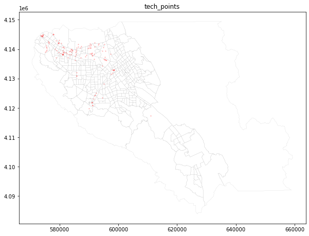
    


  

#### 6.Hospitals (Shapefiles)

  


```python
#read hospital shapefiles
hospital=gpd.read_file("Hospitals/hospital.shp")
hospital_project=hospital.to_crs("epsg:26910")

fig, ax = plt.subplots(figsize=(10,10))
demo_blocks_geo_project.plot(ax=ax, color='none', edgecolor='gray', linewidth=.1)
hospital_project_figure=hospital_project.plot(ax=ax, color='r', markersize=2, alpha=0.2)
hospital_project_figure.set_title('hospital_points')
```


    Text(0.5, 1.0, 'hospital_points')


    
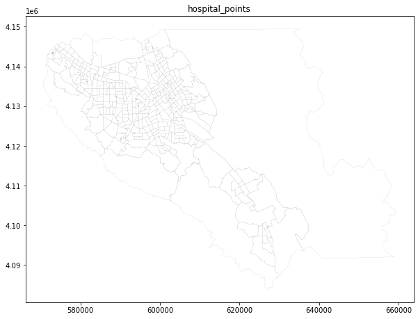
    


  

#### 7.Schools (Shapefiles)

  


```python
#read school shapefiles
school=gpd.read_file("SchoolsAreas/School.shp")
school_project=school.to_crs("epsg:26910")
school_project_centroid=school_project.centroid

fig, ax = plt.subplots(figsize=(10,10))
demo_blocks_geo_project.plot(ax=ax, color='none', edgecolor='gray', linewidth=.1)
school_project_figure=school_project_centroid.plot(ax=ax, color='r', markersize=2, alpha=0.2)
school_project_figure.set_title('school_points')
```


    Text(0.5, 1.0, 'school_points')


    
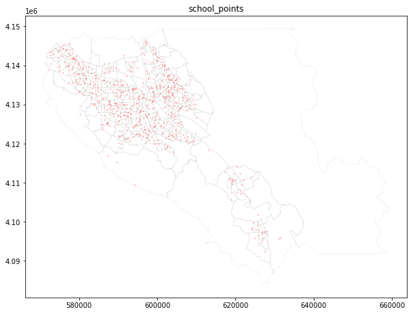
    


```python
school_project_centroid.geometry.x
```


    0      595796.388250
    1      625825.507271
    2      593656.608616
    3      620247.560637
    4      588990.662071
               ...      
    565    603022.682311
    566    603193.054769
    567    574908.900400
    568    572155.163676
    569    594997.388901
    Length: 570, dtype: float64


```python
o=0
school_ll_coor = []
for i in np.arange(570):
    school_ll_coor.append(utm.to_latlon(school_project_centroid.geometry.x[i], school_project_centroid.geometry.y[i],10,'U'))
    o=o+1
```


```python
school_xy=pd.DataFrame(school_ll_coor)
school_xy=school_xy.rename(columns={0:'y',1:'x'})
school_xy.head()
```


<div>
<style scoped>
    .dataframe tbody tr th:only-of-type {
        vertical-align: middle;
    }

    .dataframe tbody tr th {
        vertical-align: top;
    }

    .dataframe thead th {
        text-align: right;
    }
</style>
<table border="1" class="dataframe">
  <thead>
    <tr style="text-align: right;">
      <th></th>
      <th>y</th>
      <th>x</th>
    </tr>
  </thead>
  <tbody>
    <tr>
      <th>0</th>
      <td>37.256579</td>
      <td>-121.919723</td>
    </tr>
    <tr>
      <th>1</th>
      <td>37.018984</td>
      <td>-121.585538</td>
    </tr>
    <tr>
      <th>2</th>
      <td>37.343771</td>
      <td>-121.942632</td>
    </tr>
    <tr>
      <th>3</th>
      <td>37.107320</td>
      <td>-121.646671</td>
    </tr>
    <tr>
      <th>4</th>
      <td>37.262615</td>
      <td>-121.996388</td>
    </tr>
  </tbody>
</table>
</div>


  

#### 8.Rails (Shapefiles)

  


```python
#read rail shapefiles
rail=gpd.read_file("RailroadStations/rail.shp")
rail_project=rail.to_crs("epsg:26910")

fig, ax = plt.subplots(figsize=(10,10))
demo_blocks_geo_project.plot(ax=ax, color='none', edgecolor='gray', linewidth=.1)
rail_project_figure=rail_project.plot(ax=ax, color='r', markersize=2, alpha=0.2)
rail_project_figure.set_title('rail_points')
```


    Text(0.5, 1.0, 'rail_points')


    

    


  

## II-Data Processing + Analysis(i)

  

#### 1. Network Analysis (Pandana)

  


```python
#Basic Network
network = osm.pdna_network_from_bbox(36.8, -122.2, 37.5, -121.1)  # Santa Clara, CA
network.nodes_df.to_csv('nodes_SC.csv')
network.edges_df.to_csv('edges_SC.csv')
nodes = pd.read_csv('nodes_SC.csv', index_col=0)
edges = pd.read_csv('edges_SC.csv', index_col=[0,1])
network = pandana.Network(nodes['x'], nodes['y'], 
                          edges['from'], edges['to'], edges[['distance']])
```

    Requesting network data within bounding box from Overpass API in 4 request(s)
    Posting to http://www.overpass-api.de/api/interpreter with timeout=180, "{'data': '[out:json][timeout:180];(way["highway"]["highway"!~"motor|proposed|construction|abandoned|platform|raceway"]["foot"!~"no"]["pedestrians"!~"no"](36.80000000,-122.20001486,37.15629766,-121.64744886);>;);out;'}"
    Downloaded 41,778.4KB from www.overpass-api.de in 10.18 seconds
    Posting to http://www.overpass-api.de/api/interpreter with timeout=180, "{'data': '[out:json][timeout:180];(way["highway"]["highway"!~"motor|proposed|construction|abandoned|platform|raceway"]["foot"!~"no"]["pedestrians"!~"no"](37.15127925,-122.20001486,37.50128049,-121.64115963);>;);out;'}"
    Downloaded 149,754.8KB from www.overpass-api.de in 28.58 seconds
    Posting to http://www.overpass-api.de/api/interpreter with timeout=180, "{'data': '[out:json][timeout:180];(way["highway"]["highway"!~"motor|proposed|construction|abandoned|platform|raceway"]["foot"!~"no"]["pedestrians"!~"no"](37.14376639,-121.64744886,37.50128049,-121.10000000);>;);out;'}"
    Downloaded 0.7KB from www.overpass-api.de in 15.79 seconds
    Server at www.overpass-api.de returned status code 429 and no JSON data. Re-trying request in 11.00 seconds.
    Posting to http://www.overpass-api.de/api/interpreter with timeout=180, "{'data': '[out:json][timeout:180];(way["highway"]["highway"!~"motor|proposed|construction|abandoned|platform|raceway"]["foot"!~"no"]["pedestrians"!~"no"](37.14376639,-121.64744886,37.50128049,-121.10000000);>;);out;'}"
    Downloaded 7,875.2KB from www.overpass-api.de in 3.25 seconds
    Posting to http://www.overpass-api.de/api/interpreter with timeout=180, "{'data': '[out:json][timeout:180];(way["highway"]["highway"!~"motor|proposed|construction|abandoned|platform|raceway"]["foot"!~"no"]["pedestrians"!~"no"](36.80000000,-121.65363006,37.15127925,-121.10000000);>;);out;'}"
    Downloaded 0.7KB from www.overpass-api.de in 15.61 seconds
    Server at www.overpass-api.de returned status code 429 and no JSON data. Re-trying request in 11.00 seconds.
    Posting to http://www.overpass-api.de/api/interpreter with timeout=180, "{'data': '[out:json][timeout:180];(way["highway"]["highway"!~"motor|proposed|construction|abandoned|platform|raceway"]["foot"!~"no"]["pedestrians"!~"no"](36.80000000,-121.65363006,37.15127925,-121.10000000);>;);out;'}"
    Downloaded 23,513.6KB from www.overpass-api.de in 14.00 seconds
    Downloaded OSM network data within bounding box from Overpass API in 4 request(s) and 114.72 seconds
    32,403 duplicate records removed. Took 8.43 seconds
    Returning OSM data with 1,554,074 nodes and 250,891 ways...
    Edge node pairs completed. Took 146.60 seconds
    Returning processed graph with 351,380 nodes and 507,254 edges...
    Completed OSM data download and Pandana node and edge table creation in 275.77 seconds
    


```python
park_nodes = network.get_node_ids(park_project.longitude,park_project.latitude)
tech_nodes = network.get_node_ids(tech_project.Longitude,tech_project.Latitude)
school_nodes = network.get_node_ids(school_xy.x,school_xy.y)
hospital_nodes = network.get_node_ids(hospital_project.longitude,hospital_project.latitude)
rail_nodes = network.get_node_ids(rail_project.longitude,rail_project.latitude)

network.set(park_nodes, name = 'parks')
network.set(tech_nodes, name = 'tech')
network.set(school_nodes, name = 'school')
network.set(hospital_nodes, name = 'hospital')
network.set(rail_nodes, name = 'rail')
```


```python
# Network Aggregation
accessibility_park = network.aggregate(
    distance=1500,
    type='count',  # could also do mean, sum, percentile, like pandas aggregation functions
    decay='flat',  # can apply exponential or linear decay for sum/mean 
    name='parks'
)

accessibility_tech = network.aggregate(
    distance=3000,
    type='count',  # could also do mean, sum, percentile, like pandas aggregation functions
    decay='flat',  # can apply exponential or linear decay for sum/mean 
    name='tech'
)

accessibility_school = network.aggregate(
    distance=1500,
    type='count',  # could also do mean, sum, percentile, like pandas aggregation functions
    decay='flat',  # can apply exponential or linear decay for sum/mean 
    name='school'
)

accessibility_hospital = network.aggregate(
    distance=3000,
    type='count',  # could also do mean, sum, percentile, like pandas aggregation functions
    decay='flat',  # can apply exponential or linear decay for sum/mean 
    name='hospital'
)

accessibility_rail = network.aggregate(
    distance=3000,
    type='count',  # could also do mean, sum, percentile, like pandas aggregation functions
    decay='flat',  # can apply exponential or linear decay for sum/mean 
    name='rail'
)
```


```python
accessibility=[accessibility_park,accessibility_tech,accessibility_school,accessibility_hospital,accessibility_rail]
```


```python
network.nodes_df
```


<div>
<style scoped>
    .dataframe tbody tr th:only-of-type {
        vertical-align: middle;
    }

    .dataframe tbody tr th {
        vertical-align: top;
    }

    .dataframe thead th {
        text-align: right;
    }
</style>
<table border="1" class="dataframe">
  <thead>
    <tr style="text-align: right;">
      <th></th>
      <th>x</th>
      <th>y</th>
    </tr>
    <tr>
      <th>id</th>
      <th></th>
      <th></th>
    </tr>
  </thead>
  <tbody>
    <tr>
      <th>25457919</th>
      <td>-121.548457</td>
      <td>36.930232</td>
    </tr>
    <tr>
      <th>25457938</th>
      <td>-121.553913</td>
      <td>37.007868</td>
    </tr>
    <tr>
      <th>25457939</th>
      <td>-121.550781</td>
      <td>37.002077</td>
    </tr>
    <tr>
      <th>26027651</th>
      <td>-122.102672</td>
      <td>37.418131</td>
    </tr>
    <tr>
      <th>26027653</th>
      <td>-122.108639</td>
      <td>37.407976</td>
    </tr>
    <tr>
      <th>...</th>
      <td>...</td>
      <td>...</td>
    </tr>
    <tr>
      <th>9726790960</th>
      <td>-121.763962</td>
      <td>36.906939</td>
    </tr>
    <tr>
      <th>9726790965</th>
      <td>-121.763419</td>
      <td>36.907001</td>
    </tr>
    <tr>
      <th>9726790966</th>
      <td>-121.763723</td>
      <td>36.907026</td>
    </tr>
    <tr>
      <th>9726790967</th>
      <td>-121.763667</td>
      <td>36.906925</td>
    </tr>
    <tr>
      <th>9727906228</th>
      <td>-121.939186</td>
      <td>37.260596</td>
    </tr>
  </tbody>
</table>
<p>351380 rows × 2 columns</p>
</div>


```python
#Turn LAT/LON to X/Y
network_nodes_lon_list=network.nodes_df.x.to_list()
network_nodes_lat_list=network.nodes_df.y.to_list()

o=0
network_xy_coor = []
for i in network_nodes_lon_list:
    network_xy_coor.append(utm.from_latlon(network_nodes_lat_list[o],i))
    o=o+1

network_xy=pd.DataFrame(network_xy_coor)
network_xy=network_xy.rename(columns={0:'x',1:'y',2:'zone'})
network_xy.head()
```


<div>
<style scoped>
    .dataframe tbody tr th:only-of-type {
        vertical-align: middle;
    }

    .dataframe tbody tr th {
        vertical-align: top;
    }

    .dataframe thead th {
        text-align: right;
    }
</style>
<table border="1" class="dataframe">
  <thead>
    <tr style="text-align: right;">
      <th></th>
      <th>x</th>
      <th>y</th>
      <th>zone</th>
      <th>3</th>
    </tr>
  </thead>
  <tbody>
    <tr>
      <th>0</th>
      <td>629274.329992</td>
      <td>4.088117e+06</td>
      <td>10</td>
      <td>S</td>
    </tr>
    <tr>
      <th>1</th>
      <td>628657.690661</td>
      <td>4.096723e+06</td>
      <td>10</td>
      <td>S</td>
    </tr>
    <tr>
      <th>2</th>
      <td>628946.115683</td>
      <td>4.096084e+06</td>
      <td>10</td>
      <td>S</td>
    </tr>
    <tr>
      <th>3</th>
      <td>579402.250828</td>
      <td>4.141636e+06</td>
      <td>10</td>
      <td>S</td>
    </tr>
    <tr>
      <th>4</th>
      <td>578884.867009</td>
      <td>4.140505e+06</td>
      <td>10</td>
      <td>S</td>
    </tr>
  </tbody>
</table>
</div>


```python
acc = gpd.GeoDataFrame(
    network_xy, geometry=gpd.points_from_xy(network_xy.x, network_xy.y))
acc_projected=acc.set_crs("epsg:26910")
```


```python
fig, ax = plt.subplots(figsize=(15,15))
plt.title('Santa Clara: Parks within 1500m')

demo_blocks_geo_project.plot(ax=ax, color='none', edgecolor='gray', linewidth=.1)
plt.scatter(acc_projected.x, acc_projected.y, 
            c=accessibility[0], s=0.001, cmap='YlOrRd',
            norm=matplotlib.colors.LogNorm())

cb = plt.colorbar(shrink=0.6,label="level",orientation= "vertical",pad=0.1)

plt.show()
```


    
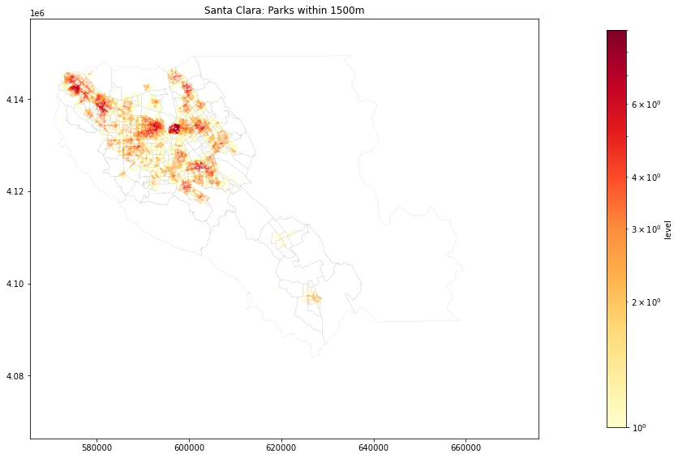
    


```python
fig, ax = plt.subplots(figsize=(15,15))
plt.title('Santa Clara: Techs within 3000m')

demo_blocks_geo_project.plot(ax=ax, color='none', edgecolor='gray', linewidth=.1)
plt.scatter(acc_projected.x, acc_projected.y, 
            c=accessibility[1], s=0.001, cmap='YlOrRd',
            norm=matplotlib.colors.LogNorm())

cb = plt.colorbar(shrink=0.6,label="level",orientation= "vertical",pad=0.1)

plt.show()
```


    
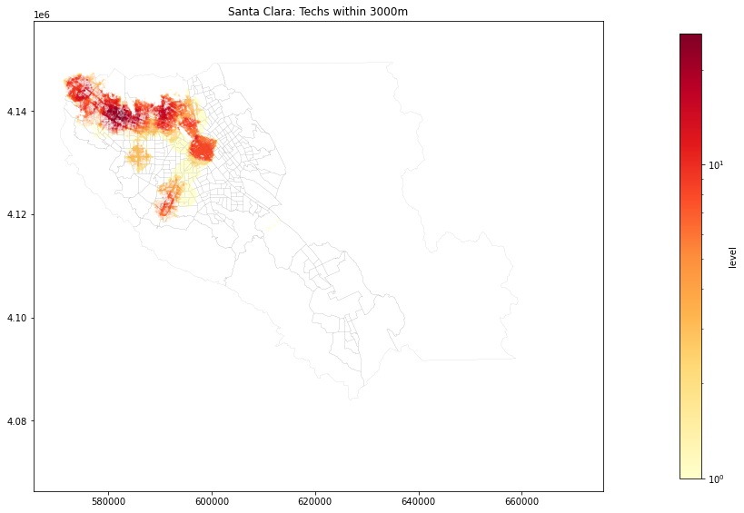
    


```python
fig, ax = plt.subplots(figsize=(15,15))
plt.title('Santa Clara: Schools within 1500m')

demo_blocks_geo_project.plot(ax=ax, color='none', edgecolor='gray', linewidth=.1)
plt.scatter(acc_projected.x, acc_projected.y, 
            c=accessibility[2], s=0.001, cmap='YlOrRd',
            norm=matplotlib.colors.LogNorm())

cb = plt.colorbar(shrink=0.6,label="level",orientation= "vertical",pad=0.1)

plt.show()
```


    
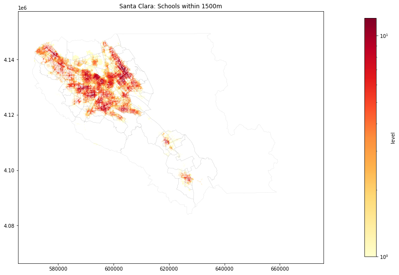
    


```python
fig, ax = plt.subplots(figsize=(15,15))
plt.title('Santa Clara: Hospitals within 3000m')

demo_blocks_geo_project.plot(ax=ax, color='none', edgecolor='gray', linewidth=.1)
plt.scatter(acc_projected.x, acc_projected.y, 
            c=accessibility[3], s=0.001, cmap='YlOrRd',
            norm=matplotlib.colors.LogNorm())

cb = plt.colorbar(shrink=0.6,label="level",orientation= "vertical",pad=0.1)

plt.show()
```


    
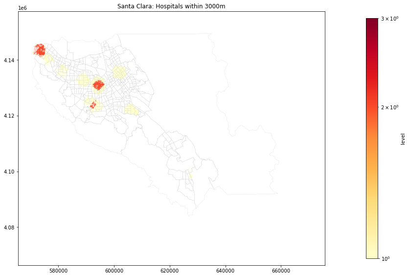
    


```python
fig, ax = plt.subplots(figsize=(15,15))
plt.title('Santa Clara: Rails within 3000m')

demo_blocks_geo_project.plot(ax=ax, color='none', edgecolor='gray', linewidth=.1)
plt.scatter(acc_projected.x, acc_projected.y, 
            c=accessibility[4], s=0.001, cmap='YlOrRd',
            norm=matplotlib.colors.LogNorm())

cb = plt.colorbar(shrink=0.6,label="level",orientation= "vertical",pad=0.1)

plt.show()
```


    
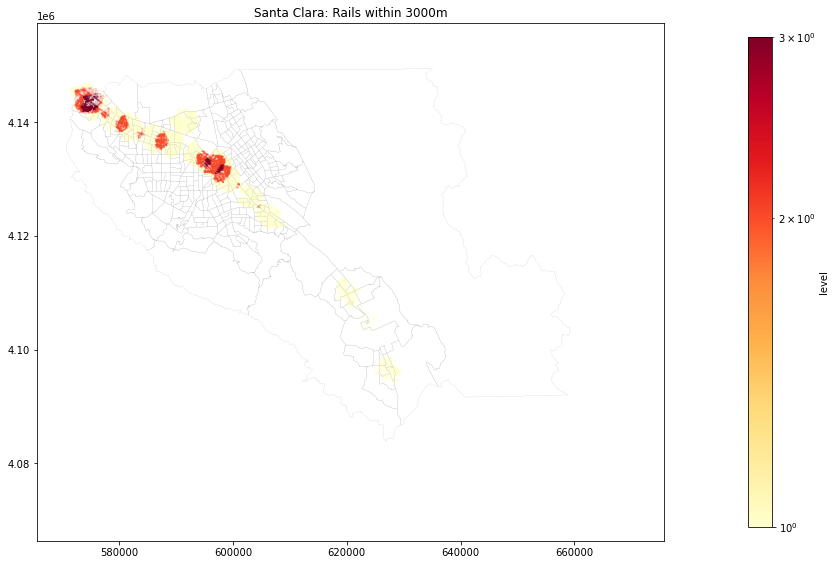
    


  

#### 2. Accessibility Data Processing (Table Joints using different weights of nodes)

  


```python
#Accessibility Data
acc_park=pd.merge(network.nodes_df,accessibility[0].to_frame(),how='outer',left_index=True,right_index=True)
acc_park=acc_park.rename(columns={0:'acc_park_weight'})

acc_tech=pd.merge(acc_park,accessibility[1].to_frame(),how='outer',left_index=True,right_index=True)
acc_tech=acc_tech.rename(columns={0:'acc_tech_weight'})

acc_school=pd.merge(acc_tech,accessibility[2].to_frame(),how='outer',left_index=True,right_index=True)
acc_school=acc_school.rename(columns={0:'acc_school_weight'})

acc_hospital=pd.merge(acc_school,accessibility[3].to_frame(),how='outer',left_index=True,right_index=True)
acc_hospital=acc_hospital.rename(columns={0:'acc_hospital_weight'})

acc_all=pd.merge(acc_hospital,accessibility[4].to_frame(),how='outer',left_index=True,right_index=True)
acc_all=acc_all.rename(columns={0:'acc_rail_weight'})
```


```python
acc_all.to_csv('acc_all.csv')
acc_all
```


<div>
<style scoped>
    .dataframe tbody tr th:only-of-type {
        vertical-align: middle;
    }

    .dataframe tbody tr th {
        vertical-align: top;
    }

    .dataframe thead th {
        text-align: right;
    }
</style>
<table border="1" class="dataframe">
  <thead>
    <tr style="text-align: right;">
      <th></th>
      <th>x</th>
      <th>y</th>
      <th>acc_park_weight</th>
      <th>acc_tech_weight</th>
      <th>acc_school_weight</th>
      <th>acc_hospital_weight</th>
      <th>acc_rail_weight</th>
    </tr>
    <tr>
      <th>id</th>
      <th></th>
      <th></th>
      <th></th>
      <th></th>
      <th></th>
      <th></th>
      <th></th>
    </tr>
  </thead>
  <tbody>
    <tr>
      <th>25457919</th>
      <td>-121.548457</td>
      <td>36.930232</td>
      <td>0.0</td>
      <td>0.0</td>
      <td>0.0</td>
      <td>0.0</td>
      <td>0.0</td>
    </tr>
    <tr>
      <th>25457938</th>
      <td>-121.553913</td>
      <td>37.007868</td>
      <td>2.0</td>
      <td>0.0</td>
      <td>2.0</td>
      <td>0.0</td>
      <td>1.0</td>
    </tr>
    <tr>
      <th>25457939</th>
      <td>-121.550781</td>
      <td>37.002077</td>
      <td>0.0</td>
      <td>0.0</td>
      <td>0.0</td>
      <td>0.0</td>
      <td>1.0</td>
    </tr>
    <tr>
      <th>26027651</th>
      <td>-122.102672</td>
      <td>37.418131</td>
      <td>1.0</td>
      <td>12.0</td>
      <td>8.0</td>
      <td>0.0</td>
      <td>1.0</td>
    </tr>
    <tr>
      <th>26027653</th>
      <td>-122.108639</td>
      <td>37.407976</td>
      <td>2.0</td>
      <td>7.0</td>
      <td>4.0</td>
      <td>0.0</td>
      <td>1.0</td>
    </tr>
    <tr>
      <th>...</th>
      <td>...</td>
      <td>...</td>
      <td>...</td>
      <td>...</td>
      <td>...</td>
      <td>...</td>
      <td>...</td>
    </tr>
    <tr>
      <th>9726790960</th>
      <td>-121.763962</td>
      <td>36.906939</td>
      <td>0.0</td>
      <td>0.0</td>
      <td>0.0</td>
      <td>0.0</td>
      <td>0.0</td>
    </tr>
    <tr>
      <th>9726790965</th>
      <td>-121.763419</td>
      <td>36.907001</td>
      <td>0.0</td>
      <td>0.0</td>
      <td>0.0</td>
      <td>0.0</td>
      <td>0.0</td>
    </tr>
    <tr>
      <th>9726790966</th>
      <td>-121.763723</td>
      <td>36.907026</td>
      <td>0.0</td>
      <td>0.0</td>
      <td>0.0</td>
      <td>0.0</td>
      <td>0.0</td>
    </tr>
    <tr>
      <th>9726790967</th>
      <td>-121.763667</td>
      <td>36.906925</td>
      <td>0.0</td>
      <td>0.0</td>
      <td>0.0</td>
      <td>0.0</td>
      <td>0.0</td>
    </tr>
    <tr>
      <th>9727906228</th>
      <td>-121.939186</td>
      <td>37.260596</td>
      <td>2.0</td>
      <td>3.0</td>
      <td>6.0</td>
      <td>1.0</td>
      <td>0.0</td>
    </tr>
  </tbody>
</table>
<p>351380 rows × 7 columns</p>
</div>


```python
#Turn LAT/LON to X/Y
acc_all_lon_list=acc_all.x.to_list()
acc_all_lat_list=acc_all.y.to_list()

o=0
acc_all_xy_coor = []
for i in acc_all_lon_list:
    acc_all_xy_coor.append(utm.from_latlon(acc_all_lat_list[o],i))
    o=o+1

acc_all_xy=pd.DataFrame(acc_all_xy_coor)
acc_all_xy=acc_all_xy.rename(columns={0:'x_coor',1:'y_coor',2:'zone'})
acc_all_xy.head()
```


<div>
<style scoped>
    .dataframe tbody tr th:only-of-type {
        vertical-align: middle;
    }

    .dataframe tbody tr th {
        vertical-align: top;
    }

    .dataframe thead th {
        text-align: right;
    }
</style>
<table border="1" class="dataframe">
  <thead>
    <tr style="text-align: right;">
      <th></th>
      <th>x_coor</th>
      <th>y_coor</th>
      <th>zone</th>
      <th>3</th>
    </tr>
  </thead>
  <tbody>
    <tr>
      <th>0</th>
      <td>629274.329992</td>
      <td>4.088117e+06</td>
      <td>10</td>
      <td>S</td>
    </tr>
    <tr>
      <th>1</th>
      <td>628657.690661</td>
      <td>4.096723e+06</td>
      <td>10</td>
      <td>S</td>
    </tr>
    <tr>
      <th>2</th>
      <td>628946.115683</td>
      <td>4.096084e+06</td>
      <td>10</td>
      <td>S</td>
    </tr>
    <tr>
      <th>3</th>
      <td>579402.250828</td>
      <td>4.141636e+06</td>
      <td>10</td>
      <td>S</td>
    </tr>
    <tr>
      <th>4</th>
      <td>578884.867009</td>
      <td>4.140505e+06</td>
      <td>10</td>
      <td>S</td>
    </tr>
  </tbody>
</table>
</div>


```python
acc_all=acc_all.reset_index()
acc_xy=pd.merge(acc_all,acc_all_xy,left_index=True,right_index=True)
acc_xy
```


<div>
<style scoped>
    .dataframe tbody tr th:only-of-type {
        vertical-align: middle;
    }

    .dataframe tbody tr th {
        vertical-align: top;
    }

    .dataframe thead th {
        text-align: right;
    }
</style>
<table border="1" class="dataframe">
  <thead>
    <tr style="text-align: right;">
      <th></th>
      <th>id</th>
      <th>x</th>
      <th>y</th>
      <th>acc_park_weight</th>
      <th>acc_tech_weight</th>
      <th>acc_school_weight</th>
      <th>acc_hospital_weight</th>
      <th>acc_rail_weight</th>
      <th>x_coor</th>
      <th>y_coor</th>
      <th>zone</th>
      <th>3</th>
    </tr>
  </thead>
  <tbody>
    <tr>
      <th>0</th>
      <td>25457919</td>
      <td>-121.548457</td>
      <td>36.930232</td>
      <td>0.0</td>
      <td>0.0</td>
      <td>0.0</td>
      <td>0.0</td>
      <td>0.0</td>
      <td>629274.329992</td>
      <td>4.088117e+06</td>
      <td>10</td>
      <td>S</td>
    </tr>
    <tr>
      <th>1</th>
      <td>25457938</td>
      <td>-121.553913</td>
      <td>37.007868</td>
      <td>2.0</td>
      <td>0.0</td>
      <td>2.0</td>
      <td>0.0</td>
      <td>1.0</td>
      <td>628657.690661</td>
      <td>4.096723e+06</td>
      <td>10</td>
      <td>S</td>
    </tr>
    <tr>
      <th>2</th>
      <td>25457939</td>
      <td>-121.550781</td>
      <td>37.002077</td>
      <td>0.0</td>
      <td>0.0</td>
      <td>0.0</td>
      <td>0.0</td>
      <td>1.0</td>
      <td>628946.115683</td>
      <td>4.096084e+06</td>
      <td>10</td>
      <td>S</td>
    </tr>
    <tr>
      <th>3</th>
      <td>26027651</td>
      <td>-122.102672</td>
      <td>37.418131</td>
      <td>1.0</td>
      <td>12.0</td>
      <td>8.0</td>
      <td>0.0</td>
      <td>1.0</td>
      <td>579402.250828</td>
      <td>4.141636e+06</td>
      <td>10</td>
      <td>S</td>
    </tr>
    <tr>
      <th>4</th>
      <td>26027653</td>
      <td>-122.108639</td>
      <td>37.407976</td>
      <td>2.0</td>
      <td>7.0</td>
      <td>4.0</td>
      <td>0.0</td>
      <td>1.0</td>
      <td>578884.867009</td>
      <td>4.140505e+06</td>
      <td>10</td>
      <td>S</td>
    </tr>
    <tr>
      <th>...</th>
      <td>...</td>
      <td>...</td>
      <td>...</td>
      <td>...</td>
      <td>...</td>
      <td>...</td>
      <td>...</td>
      <td>...</td>
      <td>...</td>
      <td>...</td>
      <td>...</td>
      <td>...</td>
    </tr>
    <tr>
      <th>351375</th>
      <td>9726790960</td>
      <td>-121.763962</td>
      <td>36.906939</td>
      <td>0.0</td>
      <td>0.0</td>
      <td>0.0</td>
      <td>0.0</td>
      <td>0.0</td>
      <td>610114.070172</td>
      <td>4.085262e+06</td>
      <td>10</td>
      <td>S</td>
    </tr>
    <tr>
      <th>351376</th>
      <td>9726790965</td>
      <td>-121.763419</td>
      <td>36.907001</td>
      <td>0.0</td>
      <td>0.0</td>
      <td>0.0</td>
      <td>0.0</td>
      <td>0.0</td>
      <td>610162.339184</td>
      <td>4.085270e+06</td>
      <td>10</td>
      <td>S</td>
    </tr>
    <tr>
      <th>351377</th>
      <td>9726790966</td>
      <td>-121.763723</td>
      <td>36.907026</td>
      <td>0.0</td>
      <td>0.0</td>
      <td>0.0</td>
      <td>0.0</td>
      <td>0.0</td>
      <td>610135.299729</td>
      <td>4.085272e+06</td>
      <td>10</td>
      <td>S</td>
    </tr>
    <tr>
      <th>351378</th>
      <td>9726790967</td>
      <td>-121.763667</td>
      <td>36.906925</td>
      <td>0.0</td>
      <td>0.0</td>
      <td>0.0</td>
      <td>0.0</td>
      <td>0.0</td>
      <td>610140.416892</td>
      <td>4.085261e+06</td>
      <td>10</td>
      <td>S</td>
    </tr>
    <tr>
      <th>351379</th>
      <td>9727906228</td>
      <td>-121.939186</td>
      <td>37.260596</td>
      <td>2.0</td>
      <td>3.0</td>
      <td>6.0</td>
      <td>1.0</td>
      <td>0.0</td>
      <td>594065.414066</td>
      <td>4.124309e+06</td>
      <td>10</td>
      <td>S</td>
    </tr>
  </tbody>
</table>
<p>351380 rows × 12 columns</p>
</div>


```python
from shapely.geometry import Point
geometry = [Point(xy) for xy in zip(acc_xy.x_coor, acc_xy.y_coor)]
acc_xy_geo = gpd.GeoDataFrame(acc_xy, crs='epsg:26910', geometry=geometry)
acc_xy_geo=acc_xy_geo.reset_index()
```


```python
#Combine all the data
join1=gpd.sjoin(acc_xy_geo,demo_blocks_geo_project,how="right",predicate='intersects')
```


```python
join1=join1.drop(columns=['index_left','index','id'])
```


```python
join1
```


<div>
<style scoped>
    .dataframe tbody tr th:only-of-type {
        vertical-align: middle;
    }

    .dataframe tbody tr th {
        vertical-align: top;
    }

    .dataframe thead th {
        text-align: right;
    }
</style>
<table border="1" class="dataframe">
  <thead>
    <tr style="text-align: right;">
      <th></th>
      <th>x</th>
      <th>y</th>
      <th>acc_park_weight</th>
      <th>acc_tech_weight</th>
      <th>acc_school_weight</th>
      <th>acc_hospital_weight</th>
      <th>acc_rail_weight</th>
      <th>x_coor</th>
      <th>y_coor</th>
      <th>zone</th>
      <th>...</th>
      <th>INTPTLON10</th>
      <th>geometry</th>
      <th>area_sqmi</th>
      <th>income_sqmi</th>
      <th>hispanic_sqmi</th>
      <th>not_hispanic_sqmi</th>
      <th>white_sqmi</th>
      <th>black_sqmi</th>
      <th>asian_sqmi</th>
      <th>total_pop_sqmi</th>
    </tr>
  </thead>
  <tbody>
    <tr>
      <th>0</th>
      <td>-121.999522</td>
      <td>37.309150</td>
      <td>4.0</td>
      <td>0.0</td>
      <td>9.0</td>
      <td>0.0</td>
      <td>0.0</td>
      <td>588658.129388</td>
      <td>4.129637e+06</td>
      <td>10</td>
      <td>...</td>
      <td>-122.0019030</td>
      <td>POLYGON ((588835.089 4129697.160, 588844.584 4...</td>
      <td>3.308922e+12</td>
      <td>2.831949e-08</td>
      <td>3.173239e-11</td>
      <td>9.338388e-10</td>
      <td>2.577879e-10</td>
      <td>0.000000e+00</td>
      <td>6.337411e-10</td>
      <td>9.655712e-10</td>
    </tr>
    <tr>
      <th>0</th>
      <td>-122.006301</td>
      <td>37.293208</td>
      <td>1.0</td>
      <td>0.0</td>
      <td>4.0</td>
      <td>0.0</td>
      <td>0.0</td>
      <td>588075.942049</td>
      <td>4.127862e+06</td>
      <td>10</td>
      <td>...</td>
      <td>-122.0019030</td>
      <td>POLYGON ((588835.089 4129697.160, 588844.584 4...</td>
      <td>3.308922e+12</td>
      <td>2.831949e-08</td>
      <td>3.173239e-11</td>
      <td>9.338388e-10</td>
      <td>2.577879e-10</td>
      <td>0.000000e+00</td>
      <td>6.337411e-10</td>
      <td>9.655712e-10</td>
    </tr>
    <tr>
      <th>0</th>
      <td>-122.001240</td>
      <td>37.309615</td>
      <td>3.0</td>
      <td>0.0</td>
      <td>8.0</td>
      <td>0.0</td>
      <td>0.0</td>
      <td>588505.328935</td>
      <td>4.129687e+06</td>
      <td>10</td>
      <td>...</td>
      <td>-122.0019030</td>
      <td>POLYGON ((588835.089 4129697.160, 588844.584 4...</td>
      <td>3.308922e+12</td>
      <td>2.831949e-08</td>
      <td>3.173239e-11</td>
      <td>9.338388e-10</td>
      <td>2.577879e-10</td>
      <td>0.000000e+00</td>
      <td>6.337411e-10</td>
      <td>9.655712e-10</td>
    </tr>
    <tr>
      <th>0</th>
      <td>-122.001534</td>
      <td>37.308765</td>
      <td>3.0</td>
      <td>0.0</td>
      <td>8.0</td>
      <td>0.0</td>
      <td>0.0</td>
      <td>588480.280621</td>
      <td>4.129593e+06</td>
      <td>10</td>
      <td>...</td>
      <td>-122.0019030</td>
      <td>POLYGON ((588835.089 4129697.160, 588844.584 4...</td>
      <td>3.308922e+12</td>
      <td>2.831949e-08</td>
      <td>3.173239e-11</td>
      <td>9.338388e-10</td>
      <td>2.577879e-10</td>
      <td>0.000000e+00</td>
      <td>6.337411e-10</td>
      <td>9.655712e-10</td>
    </tr>
    <tr>
      <th>0</th>
      <td>-122.002539</td>
      <td>37.306074</td>
      <td>3.0</td>
      <td>0.0</td>
      <td>6.0</td>
      <td>0.0</td>
      <td>0.0</td>
      <td>588394.307217</td>
      <td>4.129293e+06</td>
      <td>10</td>
      <td>...</td>
      <td>-122.0019030</td>
      <td>POLYGON ((588835.089 4129697.160, 588844.584 4...</td>
      <td>3.308922e+12</td>
      <td>2.831949e-08</td>
      <td>3.173239e-11</td>
      <td>9.338388e-10</td>
      <td>2.577879e-10</td>
      <td>0.000000e+00</td>
      <td>6.337411e-10</td>
      <td>9.655712e-10</td>
    </tr>
    <tr>
      <th>...</th>
      <td>...</td>
      <td>...</td>
      <td>...</td>
      <td>...</td>
      <td>...</td>
      <td>...</td>
      <td>...</td>
      <td>...</td>
      <td>...</td>
      <td>...</td>
      <td>...</td>
      <td>...</td>
      <td>...</td>
      <td>...</td>
      <td>...</td>
      <td>...</td>
      <td>...</td>
      <td>...</td>
      <td>...</td>
      <td>...</td>
      <td>...</td>
    </tr>
    <tr>
      <th>371</th>
      <td>-121.852534</td>
      <td>37.397357</td>
      <td>2.0</td>
      <td>0.0</td>
      <td>8.0</td>
      <td>0.0</td>
      <td>0.0</td>
      <td>601565.064117</td>
      <td>4.139572e+06</td>
      <td>10</td>
      <td>...</td>
      <td>-121.8548247</td>
      <td>POLYGON ((600853.038 4139388.395, 600839.835 4...</td>
      <td>3.818682e+12</td>
      <td>1.139451e-08</td>
      <td>2.291367e-10</td>
      <td>1.053243e-09</td>
      <td>1.461237e-10</td>
      <td>1.754532e-11</td>
      <td>8.576258e-10</td>
      <td>1.282380e-09</td>
    </tr>
    <tr>
      <th>371</th>
      <td>-121.852898</td>
      <td>37.398001</td>
      <td>2.0</td>
      <td>0.0</td>
      <td>8.0</td>
      <td>0.0</td>
      <td>0.0</td>
      <td>601531.940254</td>
      <td>4.139643e+06</td>
      <td>10</td>
      <td>...</td>
      <td>-121.8548247</td>
      <td>POLYGON ((600853.038 4139388.395, 600839.835 4...</td>
      <td>3.818682e+12</td>
      <td>1.139451e-08</td>
      <td>2.291367e-10</td>
      <td>1.053243e-09</td>
      <td>1.461237e-10</td>
      <td>1.754532e-11</td>
      <td>8.576258e-10</td>
      <td>1.282380e-09</td>
    </tr>
    <tr>
      <th>371</th>
      <td>-121.852831</td>
      <td>37.397861</td>
      <td>2.0</td>
      <td>0.0</td>
      <td>8.0</td>
      <td>0.0</td>
      <td>0.0</td>
      <td>601538.139453</td>
      <td>4.139627e+06</td>
      <td>10</td>
      <td>...</td>
      <td>-121.8548247</td>
      <td>POLYGON ((600853.038 4139388.395, 600839.835 4...</td>
      <td>3.818682e+12</td>
      <td>1.139451e-08</td>
      <td>2.291367e-10</td>
      <td>1.053243e-09</td>
      <td>1.461237e-10</td>
      <td>1.754532e-11</td>
      <td>8.576258e-10</td>
      <td>1.282380e-09</td>
    </tr>
    <tr>
      <th>371</th>
      <td>-121.856223</td>
      <td>37.395698</td>
      <td>1.0</td>
      <td>0.0</td>
      <td>7.0</td>
      <td>0.0</td>
      <td>0.0</td>
      <td>601240.815238</td>
      <td>4.139384e+06</td>
      <td>10</td>
      <td>...</td>
      <td>-121.8548247</td>
      <td>POLYGON ((600853.038 4139388.395, 600839.835 4...</td>
      <td>3.818682e+12</td>
      <td>1.139451e-08</td>
      <td>2.291367e-10</td>
      <td>1.053243e-09</td>
      <td>1.461237e-10</td>
      <td>1.754532e-11</td>
      <td>8.576258e-10</td>
      <td>1.282380e-09</td>
    </tr>
    <tr>
      <th>371</th>
      <td>-121.856543</td>
      <td>37.396380</td>
      <td>1.0</td>
      <td>0.0</td>
      <td>7.0</td>
      <td>0.0</td>
      <td>0.0</td>
      <td>601211.518356</td>
      <td>4.139459e+06</td>
      <td>10</td>
      <td>...</td>
      <td>-121.8548247</td>
      <td>POLYGON ((600853.038 4139388.395, 600839.835 4...</td>
      <td>3.818682e+12</td>
      <td>1.139451e-08</td>
      <td>2.291367e-10</td>
      <td>1.053243e-09</td>
      <td>1.461237e-10</td>
      <td>1.754532e-11</td>
      <td>8.576258e-10</td>
      <td>1.282380e-09</td>
    </tr>
  </tbody>
</table>
<p>279742 rows × 43 columns</p>
</div>


  

#### 3. Data Processing for regression (Groupby to get mean weights/prices/... for each tract)

  


```python
# Mean accessibility for each tract
join_weight_mean=join1.groupby('GEOID10')[['acc_park_weight','acc_tech_weight','acc_school_weight','acc_hospital_weight','acc_rail_weight']].mean()
```


```python
join_weight_mean
```


<div>
<style scoped>
    .dataframe tbody tr th:only-of-type {
        vertical-align: middle;
    }

    .dataframe tbody tr th {
        vertical-align: top;
    }

    .dataframe thead th {
        text-align: right;
    }
</style>
<table border="1" class="dataframe">
  <thead>
    <tr style="text-align: right;">
      <th></th>
      <th>acc_park_weight</th>
      <th>acc_tech_weight</th>
      <th>acc_school_weight</th>
      <th>acc_hospital_weight</th>
      <th>acc_rail_weight</th>
    </tr>
    <tr>
      <th>GEOID10</th>
      <th></th>
      <th></th>
      <th></th>
      <th></th>
      <th></th>
    </tr>
  </thead>
  <tbody>
    <tr>
      <th>06085500100</th>
      <td>1.994966</td>
      <td>4.074664</td>
      <td>3.230705</td>
      <td>0.000000</td>
      <td>0.294463</td>
    </tr>
    <tr>
      <th>06085500200</th>
      <td>5.694102</td>
      <td>8.413580</td>
      <td>2.698903</td>
      <td>0.000000</td>
      <td>1.563100</td>
    </tr>
    <tr>
      <th>06085500300</th>
      <td>3.616373</td>
      <td>7.789624</td>
      <td>2.886245</td>
      <td>0.009043</td>
      <td>2.018087</td>
    </tr>
    <tr>
      <th>06085500400</th>
      <td>2.586630</td>
      <td>2.502046</td>
      <td>4.016371</td>
      <td>1.016371</td>
      <td>2.916780</td>
    </tr>
    <tr>
      <th>06085500500</th>
      <td>0.958403</td>
      <td>1.727121</td>
      <td>5.782862</td>
      <td>1.886023</td>
      <td>1.805324</td>
    </tr>
    <tr>
      <th>...</th>
      <td>...</td>
      <td>...</td>
      <td>...</td>
      <td>...</td>
      <td>...</td>
    </tr>
    <tr>
      <th>06085512602</th>
      <td>0.136817</td>
      <td>0.000000</td>
      <td>0.436378</td>
      <td>0.222577</td>
      <td>0.513363</td>
    </tr>
    <tr>
      <th>06085512603</th>
      <td>1.422750</td>
      <td>0.000000</td>
      <td>2.842105</td>
      <td>0.000000</td>
      <td>0.993209</td>
    </tr>
    <tr>
      <th>06085512604</th>
      <td>1.367397</td>
      <td>0.000000</td>
      <td>3.381995</td>
      <td>0.369830</td>
      <td>0.917275</td>
    </tr>
    <tr>
      <th>06085513000</th>
      <td>2.865263</td>
      <td>10.629053</td>
      <td>3.117053</td>
      <td>1.971789</td>
      <td>2.911579</td>
    </tr>
    <tr>
      <th>06085513500</th>
      <td>0.016503</td>
      <td>0.000952</td>
      <td>0.019359</td>
      <td>0.000000</td>
      <td>0.000000</td>
    </tr>
  </tbody>
</table>
<p>372 rows × 5 columns</p>
</div>


```python
join2=gpd.sjoin(housing_points_projected,demo_blocks_geo_project,how="right",predicate='intersects')
```


```python
# Mean housing data for each tract
join_housing_mean=join2.groupby('GEOID10')[['price_num','Beds_num','Baths_num','Size_num']].mean()
```


```python
join_housing_mean
```


<div>
<style scoped>
    .dataframe tbody tr th:only-of-type {
        vertical-align: middle;
    }

    .dataframe tbody tr th {
        vertical-align: top;
    }

    .dataframe thead th {
        text-align: right;
    }
</style>
<table border="1" class="dataframe">
  <thead>
    <tr style="text-align: right;">
      <th></th>
      <th>price_num</th>
      <th>Beds_num</th>
      <th>Baths_num</th>
      <th>Size_num</th>
    </tr>
    <tr>
      <th>GEOID10</th>
      <th></th>
      <th></th>
      <th></th>
      <th></th>
    </tr>
  </thead>
  <tbody>
    <tr>
      <th>06085500100</th>
      <td>1.158600e+06</td>
      <td>2.800000</td>
      <td>2.100000</td>
      <td>1469.400000</td>
    </tr>
    <tr>
      <th>06085500200</th>
      <td>2.921972e+06</td>
      <td>4.250000</td>
      <td>3.375000</td>
      <td>4738.500000</td>
    </tr>
    <tr>
      <th>06085500300</th>
      <td>1.198000e+06</td>
      <td>3.000000</td>
      <td>1.000000</td>
      <td>1371.000000</td>
    </tr>
    <tr>
      <th>06085500400</th>
      <td>2.424000e+06</td>
      <td>3.000000</td>
      <td>1.500000</td>
      <td>4067.000000</td>
    </tr>
    <tr>
      <th>06085500500</th>
      <td>4.680000e+06</td>
      <td>3.000000</td>
      <td>2.000000</td>
      <td>6920.000000</td>
    </tr>
    <tr>
      <th>...</th>
      <td>...</td>
      <td>...</td>
      <td>...</td>
      <td>...</td>
    </tr>
    <tr>
      <th>06085512602</th>
      <td>1.399000e+06</td>
      <td>2.000000</td>
      <td>1.000000</td>
      <td>1040.000000</td>
    </tr>
    <tr>
      <th>06085512603</th>
      <td>7.399000e+05</td>
      <td>2.000000</td>
      <td>2.000000</td>
      <td>1116.000000</td>
    </tr>
    <tr>
      <th>06085512604</th>
      <td>5.396333e+05</td>
      <td>2.666667</td>
      <td>2.333333</td>
      <td>1319.666667</td>
    </tr>
    <tr>
      <th>06085513000</th>
      <td>NaN</td>
      <td>NaN</td>
      <td>NaN</td>
      <td>NaN</td>
    </tr>
    <tr>
      <th>06085513500</th>
      <td>1.650000e+06</td>
      <td>1.000000</td>
      <td>2.000000</td>
      <td>1930.000000</td>
    </tr>
  </tbody>
</table>
<p>372 rows × 4 columns</p>
</div>


```python
# Mean number of crime cases for each tract
join3=gpd.sjoin(crime_points_projected,demo_blocks_geo_project,how="right",predicate='intersects')
join3['count']=join3['zone']/10
```


```python
join_crime_count=join3.groupby('GEOID10')[['count']].count()
```


```python
join_crime_count
```


<div>
<style scoped>
    .dataframe tbody tr th:only-of-type {
        vertical-align: middle;
    }

    .dataframe tbody tr th {
        vertical-align: top;
    }

    .dataframe thead th {
        text-align: right;
    }
</style>
<table border="1" class="dataframe">
  <thead>
    <tr style="text-align: right;">
      <th></th>
      <th>count</th>
    </tr>
    <tr>
      <th>GEOID10</th>
      <th></th>
    </tr>
  </thead>
  <tbody>
    <tr>
      <th>06085500100</th>
      <td>0</td>
    </tr>
    <tr>
      <th>06085500200</th>
      <td>6</td>
    </tr>
    <tr>
      <th>06085500300</th>
      <td>2</td>
    </tr>
    <tr>
      <th>06085500400</th>
      <td>2</td>
    </tr>
    <tr>
      <th>06085500500</th>
      <td>2</td>
    </tr>
    <tr>
      <th>...</th>
      <td>...</td>
    </tr>
    <tr>
      <th>06085512602</th>
      <td>7</td>
    </tr>
    <tr>
      <th>06085512603</th>
      <td>1</td>
    </tr>
    <tr>
      <th>06085512604</th>
      <td>1</td>
    </tr>
    <tr>
      <th>06085513000</th>
      <td>1</td>
    </tr>
    <tr>
      <th>06085513500</th>
      <td>10</td>
    </tr>
  </tbody>
</table>
<p>372 rows × 1 columns</p>
</div>


```python
# Data for Regression in the next step
merge01=pd.merge(join_weight_mean,demo_blocks_geo_project,on='GEOID10',how='outer')
merge02=pd.merge(join_housing_mean,merge01,on='GEOID10',how='outer')
final=pd.merge(join_crime_count,merge02,on='GEOID10',how='outer')
final
```


<div>
<style scoped>
    .dataframe tbody tr th:only-of-type {
        vertical-align: middle;
    }

    .dataframe tbody tr th {
        vertical-align: top;
    }

    .dataframe thead th {
        text-align: right;
    }
</style>
<table border="1" class="dataframe">
  <thead>
    <tr style="text-align: right;">
      <th></th>
      <th>GEOID10</th>
      <th>count</th>
      <th>price_num</th>
      <th>Beds_num</th>
      <th>Baths_num</th>
      <th>Size_num</th>
      <th>acc_park_weight</th>
      <th>acc_tech_weight</th>
      <th>acc_school_weight</th>
      <th>acc_hospital_weight</th>
      <th>...</th>
      <th>INTPTLON10</th>
      <th>geometry</th>
      <th>area_sqmi</th>
      <th>income_sqmi</th>
      <th>hispanic_sqmi</th>
      <th>not_hispanic_sqmi</th>
      <th>white_sqmi</th>
      <th>black_sqmi</th>
      <th>asian_sqmi</th>
      <th>total_pop_sqmi</th>
    </tr>
  </thead>
  <tbody>
    <tr>
      <th>0</th>
      <td>06085500100</td>
      <td>0</td>
      <td>1.158600e+06</td>
      <td>2.800000</td>
      <td>2.100000</td>
      <td>1469.400000</td>
      <td>1.994966</td>
      <td>4.074664</td>
      <td>3.230705</td>
      <td>0.000000</td>
      <td>...</td>
      <td>-121.8927423</td>
      <td>POLYGON ((597935.503 4135743.433, 597968.307 4...</td>
      <td>5.058890e+12</td>
      <td>7.672236e-09</td>
      <td>9.083020e-10</td>
      <td>7.335601e-10</td>
      <td>2.188227e-10</td>
      <td>4.566219e-11</td>
      <td>3.945530e-10</td>
      <td>1.641862e-09</td>
    </tr>
    <tr>
      <th>1</th>
      <td>06085500200</td>
      <td>6</td>
      <td>2.921972e+06</td>
      <td>4.250000</td>
      <td>3.375000</td>
      <td>4738.500000</td>
      <td>5.694102</td>
      <td>8.413580</td>
      <td>2.698903</td>
      <td>0.000000</td>
      <td>...</td>
      <td>-121.9021927</td>
      <td>POLYGON ((597846.772 4133448.396, 597865.107 4...</td>
      <td>4.400515e+12</td>
      <td>1.166341e-08</td>
      <td>5.017594e-10</td>
      <td>8.546727e-10</td>
      <td>4.113155e-10</td>
      <td>9.203468e-11</td>
      <td>2.676959e-10</td>
      <td>1.356432e-09</td>
    </tr>
    <tr>
      <th>2</th>
      <td>06085500300</td>
      <td>2</td>
      <td>1.198000e+06</td>
      <td>3.000000</td>
      <td>1.000000</td>
      <td>1371.000000</td>
      <td>3.616373</td>
      <td>7.789624</td>
      <td>2.886245</td>
      <td>0.009043</td>
      <td>...</td>
      <td>-121.9079708</td>
      <td>POLYGON ((597060.722 4131620.718, 597051.778 4...</td>
      <td>7.593415e+12</td>
      <td>6.982498e-09</td>
      <td>1.579000e-10</td>
      <td>3.409533e-10</td>
      <td>1.945106e-10</td>
      <td>2.660200e-11</td>
      <td>8.230816e-11</td>
      <td>4.988533e-10</td>
    </tr>
    <tr>
      <th>3</th>
      <td>06085500400</td>
      <td>2</td>
      <td>2.424000e+06</td>
      <td>3.000000</td>
      <td>1.500000</td>
      <td>4067.000000</td>
      <td>2.586630</td>
      <td>2.502046</td>
      <td>4.016371</td>
      <td>1.016371</td>
      <td>...</td>
      <td>-121.9220533</td>
      <td>POLYGON ((595241.401 4132537.091, 595228.852 4...</td>
      <td>2.622428e+12</td>
      <td>1.840165e-08</td>
      <td>3.904779e-10</td>
      <td>6.227055e-10</td>
      <td>3.958164e-10</td>
      <td>5.147902e-11</td>
      <td>1.102032e-10</td>
      <td>1.013183e-09</td>
    </tr>
    <tr>
      <th>4</th>
      <td>06085500500</td>
      <td>2</td>
      <td>4.680000e+06</td>
      <td>3.000000</td>
      <td>2.000000</td>
      <td>6920.000000</td>
      <td>0.958403</td>
      <td>1.727121</td>
      <td>5.782862</td>
      <td>1.886023</td>
      <td>...</td>
      <td>-121.9279383</td>
      <td>POLYGON ((594867.676 4131678.129, 594853.057 4...</td>
      <td>5.545853e+12</td>
      <td>1.150842e-08</td>
      <td>2.037558e-10</td>
      <td>7.879762e-10</td>
      <td>5.652872e-10</td>
      <td>3.407952e-11</td>
      <td>1.559724e-10</td>
      <td>9.917320e-10</td>
    </tr>
    <tr>
      <th>...</th>
      <td>...</td>
      <td>...</td>
      <td>...</td>
      <td>...</td>
      <td>...</td>
      <td>...</td>
      <td>...</td>
      <td>...</td>
      <td>...</td>
      <td>...</td>
      <td>...</td>
      <td>...</td>
      <td>...</td>
      <td>...</td>
      <td>...</td>
      <td>...</td>
      <td>...</td>
      <td>...</td>
      <td>...</td>
      <td>...</td>
      <td>...</td>
    </tr>
    <tr>
      <th>367</th>
      <td>06085512602</td>
      <td>7</td>
      <td>1.399000e+06</td>
      <td>2.000000</td>
      <td>1.000000</td>
      <td>1040.000000</td>
      <td>0.136817</td>
      <td>0.000000</td>
      <td>0.436378</td>
      <td>0.222577</td>
      <td>...</td>
      <td>-121.5244284</td>
      <td>POLYGON ((633385.008 4092803.783, 633362.113 4...</td>
      <td>2.515665e+14</td>
      <td>1.399551e-10</td>
      <td>3.939317e-12</td>
      <td>5.616806e-12</td>
      <td>4.344776e-12</td>
      <td>3.577584e-14</td>
      <td>1.152777e-12</td>
      <td>9.556123e-12</td>
    </tr>
    <tr>
      <th>368</th>
      <td>06085512603</td>
      <td>1</td>
      <td>7.399000e+05</td>
      <td>2.000000</td>
      <td>2.000000</td>
      <td>1116.000000</td>
      <td>1.422750</td>
      <td>0.000000</td>
      <td>2.842105</td>
      <td>0.000000</td>
      <td>...</td>
      <td>-121.5626698</td>
      <td>POLYGON ((628020.942 4094765.671, 628003.246 4...</td>
      <td>5.406028e+12</td>
      <td>5.120210e-09</td>
      <td>7.356603e-10</td>
      <td>1.215310e-10</td>
      <td>8.120565e-11</td>
      <td>1.849787e-12</td>
      <td>3.163136e-11</td>
      <td>8.571913e-10</td>
    </tr>
    <tr>
      <th>369</th>
      <td>06085512604</td>
      <td>1</td>
      <td>5.396333e+05</td>
      <td>2.666667</td>
      <td>2.333333</td>
      <td>1319.666667</td>
      <td>1.367397</td>
      <td>0.000000</td>
      <td>3.381995</td>
      <td>0.369830</td>
      <td>...</td>
      <td>-121.5705799</td>
      <td>POLYGON ((626944.018 4096833.441, 626912.424 4...</td>
      <td>5.742359e+12</td>
      <td>5.018844e-09</td>
      <td>7.300136e-10</td>
      <td>1.208563e-10</td>
      <td>8.550494e-11</td>
      <td>5.050190e-12</td>
      <td>2.159391e-11</td>
      <td>8.508699e-10</td>
    </tr>
    <tr>
      <th>370</th>
      <td>06085513000</td>
      <td>1</td>
      <td>NaN</td>
      <td>NaN</td>
      <td>NaN</td>
      <td>NaN</td>
      <td>2.865263</td>
      <td>10.629053</td>
      <td>3.117053</td>
      <td>1.971789</td>
      <td>...</td>
      <td>-122.1617917</td>
      <td>POLYGON ((573179.286 4142595.556, 573217.073 4...</td>
      <td>7.125785e+12</td>
      <td>3.132006e-09</td>
      <td>2.057317e-10</td>
      <td>1.138401e-09</td>
      <td>5.588156e-10</td>
      <td>3.508386e-11</td>
      <td>4.537044e-10</td>
      <td>1.344133e-09</td>
    </tr>
    <tr>
      <th>371</th>
      <td>06085513500</td>
      <td>10</td>
      <td>1.650000e+06</td>
      <td>1.000000</td>
      <td>2.000000</td>
      <td>1930.000000</td>
      <td>0.016503</td>
      <td>0.000952</td>
      <td>0.019359</td>
      <td>0.000000</td>
      <td>...</td>
      <td>-121.5279664</td>
      <td>POLYGON ((640526.307 4139257.367, 640565.138 4...</td>
      <td>3.984013e+15</td>
      <td>9.299419e-12</td>
      <td>1.184735e-13</td>
      <td>1.832324e-13</td>
      <td>1.322787e-13</td>
      <td>6.275081e-15</td>
      <td>2.886537e-14</td>
      <td>3.017059e-13</td>
    </tr>
  </tbody>
</table>
<p>372 rows × 42 columns</p>
</div>


```python
final.to_csv('final.csv')
```


```python
final=pd.read_csv('final.csv')
```


```python
final.columns
```


    Index(['Unnamed: 0', 'GEOID10', 'count', 'price_num', 'Beds_num', 'Baths_num',
           'Size_num', 'acc_park_weight', 'acc_tech_weight', 'acc_school_weight',
           'acc_hospital_weight', 'acc_rail_weight', 'NAME', 'B01001_001E',
           'B07011_001E', 'B03003_003E', 'B03003_002E', 'B03002_003E',
           'B03002_004E', 'B03002_006E', 'state', 'county', 'tract', 'STATEFP10',
           'COUNTYFP10', 'TRACTCE10', 'NAME10', 'NAMELSAD10', 'MTFCC10',
           'FUNCSTAT10', 'ALAND10', 'AWATER10', 'INTPTLAT10', 'INTPTLON10',
           'geometry', 'area_sqmi', 'income_sqmi', 'hispanic_sqmi',
           'not_hispanic_sqmi', 'white_sqmi', 'black_sqmi', 'asian_sqmi',
           'total_pop_sqmi'],
          dtype='object')


  

## III-Data Processing + Analysis(ii)

  

#### 1.Basic Non-Spatial Regression (PySAL)

  


```python
#Basic Non-Spatial Regression
x1=['Beds_num','Baths_num','Size_num','acc_park_weight','acc_tech_weight', 'acc_school_weight','acc_hospital_weight', 'acc_rail_weight','count']
yxs =final.loc[:, x1+['price_num']].dropna()
y=np.log(yxs['price_num']+0.000001)
w=libpysal.weights.KNN(final.loc[yxs.index,['INTPTLON10', 'INTPTLAT10']].values)
m1 = spreg.OLS(y.values[:, None], yxs.drop('price_num', axis=1).values, \
                  w=w,spat_diag=True, \
                  name_x=yxs.drop('price_num', axis=1).columns.tolist(), name_y='ln(price)')
```


```python
print(m1.summary)
```

    REGRESSION
    ----------
    SUMMARY OF OUTPUT: ORDINARY LEAST SQUARES
    -----------------------------------------
    Data set            :     unknown
    Weights matrix      :     unknown
    Dependent Variable  :   ln(price)                Number of Observations:         323
    Mean dependent var  :     14.2380                Number of Variables   :          10
    S.D. dependent var  :      0.5964                Degrees of Freedom    :         313
    R-squared           :      0.5862
    Adjusted R-squared  :      0.5743
    Sum squared residual:      47.385                F-statistic           :     49.2749
    Sigma-square        :       0.151                Prob(F-statistic)     :   7.135e-55
    S.E. of regression  :       0.389                Log likelihood        :    -148.344
    Sigma-square ML     :       0.147                Akaike info criterion :     316.688
    S.E of regression ML:      0.3830                Schwarz criterion     :     354.464
    
    ------------------------------------------------------------------------------------
                Variable     Coefficient       Std.Error     t-Statistic     Probability
    ------------------------------------------------------------------------------------
                CONSTANT      12.6484532       0.1029991     122.8015682       0.0000000
                Beds_num       0.1704467       0.0362466       4.7024193       0.0000039
               Baths_num       0.2001920       0.0494571       4.0477902       0.0000652
                Size_num       0.0001936       0.0000170      11.4118402       0.0000000
         acc_park_weight       0.0653653       0.0227924       2.8678609       0.0044131
         acc_tech_weight       0.0224028       0.0063236       3.5427113       0.0004563
       acc_school_weight       0.0069171       0.0129189       0.5354258       0.5927357
     acc_hospital_weight       0.0970026       0.0509726       1.9030337       0.0579535
         acc_rail_weight      -0.0490543       0.0436893      -1.1227994       0.2623832
                   count      -0.0003050       0.0006579      -0.4636548       0.6432174
    ------------------------------------------------------------------------------------
    
    REGRESSION DIAGNOSTICS
    MULTICOLLINEARITY CONDITION NUMBER           18.293
    
    TEST ON NORMALITY OF ERRORS
    TEST                             DF        VALUE           PROB
    Jarque-Bera                       2         105.212           0.0000
    
    DIAGNOSTICS FOR HETEROSKEDASTICITY
    RANDOM COEFFICIENTS
    TEST                             DF        VALUE           PROB
    Breusch-Pagan test                9          34.114           0.0001
    Koenker-Bassett test              9          16.188           0.0631
    
    DIAGNOSTICS FOR SPATIAL DEPENDENCE
    TEST                           MI/DF       VALUE           PROB
    Lagrange Multiplier (lag)         1          91.406           0.0000
    Robust LM (lag)                   1          27.273           0.0000
    Lagrange Multiplier (error)       1          66.571           0.0000
    Robust LM (error)                 1           2.438           0.1184
    Lagrange Multiplier (SARMA)       2          93.844           0.0000
    
    ================================ END OF REPORT =====================================
    


```python
#Visualize Regression
fig, ax = plt.subplots(3,3, figsize=(20,20))
a=0
for i in np.arange(3):
    for j in np.arange(3):
        a=a+1
        sns.regplot(x=m1.x[:,a], y=m1.y,ax=ax[i,j], color='blue')
        ax[i,j].set_title(x1[a-1] +'-price'+ ' regression')
```


    
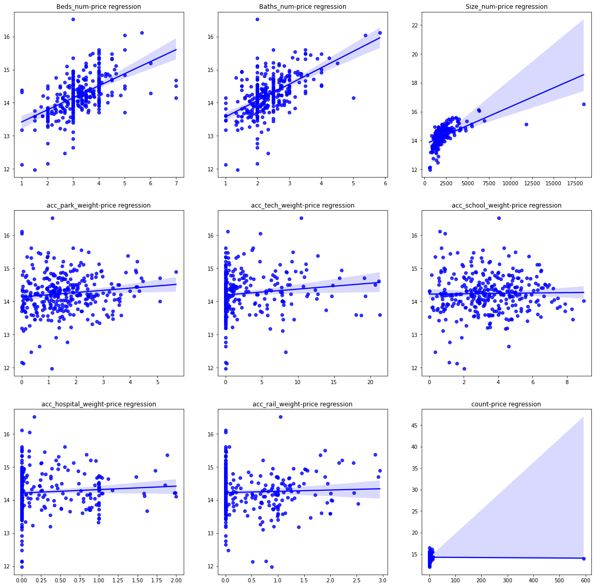
    


```python
p_value=pd.DataFrame(m1.t_stat)
```


```python
coeff=pd.DataFrame(m1.betas)
```


```python
p_value['coeff']=coeff
```


```python
#Visualize P-values & Coefficients
fig, ax = plt.subplots(1,2,figsize=(20,7))

sns.barplot(x=np.arange(9), y=p_value[1][1:10], color="blue",ax=ax[0])
sns.barplot(x=np.arange(9), y=p_value['coeff'][1:10], color="blue",ax=ax[1])

ax[0].axhline(0, color="k", clip_on=False)
ax[1].axhline(0, color="k", clip_on=False)

ax[0].set_xlabel("Variable")
ax[0].set_ylabel("P-value")

ax[1].set_xlabel("Variable")
ax[1].set_ylabel("coefficient")
```


    Text(0, 0.5, 'coefficient')


    
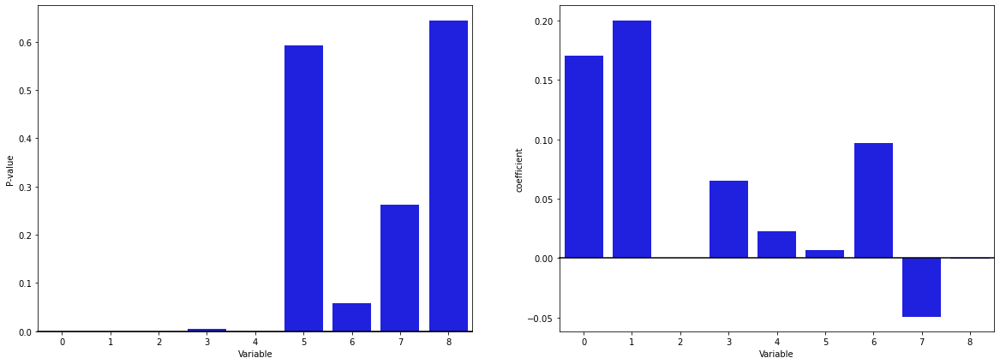
    


  

#### 2.Geographically Weighted Regression Model (GWR)

  


```python
#Data Preparation
yxs2 =final.loc[:, x1+['price_num','INTPTLAT10','INTPTLON10','geometry','GEOID10','ALAND10']].dropna()
yxs2
```


<div>
<style scoped>
    .dataframe tbody tr th:only-of-type {
        vertical-align: middle;
    }

    .dataframe tbody tr th {
        vertical-align: top;
    }

    .dataframe thead th {
        text-align: right;
    }
</style>
<table border="1" class="dataframe">
  <thead>
    <tr style="text-align: right;">
      <th></th>
      <th>Beds_num</th>
      <th>Baths_num</th>
      <th>Size_num</th>
      <th>acc_park_weight</th>
      <th>acc_tech_weight</th>
      <th>acc_school_weight</th>
      <th>acc_hospital_weight</th>
      <th>acc_rail_weight</th>
      <th>count</th>
      <th>price_num</th>
      <th>INTPTLAT10</th>
      <th>INTPTLON10</th>
      <th>geometry</th>
      <th>GEOID10</th>
      <th>ALAND10</th>
    </tr>
  </thead>
  <tbody>
    <tr>
      <th>0</th>
      <td>2.800000</td>
      <td>2.100000</td>
      <td>1469.400000</td>
      <td>1.994966</td>
      <td>4.074664</td>
      <td>3.230705</td>
      <td>0.000000</td>
      <td>0.294463</td>
      <td>0</td>
      <td>1.158600e+06</td>
      <td>37.358556</td>
      <td>-121.892742</td>
      <td>POLYGON ((597935.5034962505 4135743.433330479,...</td>
      <td>6085500100</td>
      <td>1954341</td>
    </tr>
    <tr>
      <th>1</th>
      <td>4.250000</td>
      <td>3.375000</td>
      <td>4738.500000</td>
      <td>5.694102</td>
      <td>8.413580</td>
      <td>2.698903</td>
      <td>0.000000</td>
      <td>1.563100</td>
      <td>6</td>
      <td>2.921972e+06</td>
      <td>37.349879</td>
      <td>-121.902193</td>
      <td>POLYGON ((597846.7724980968 4133448.3956936793...</td>
      <td>6085500200</td>
      <td>1700003</td>
    </tr>
    <tr>
      <th>2</th>
      <td>3.000000</td>
      <td>1.000000</td>
      <td>1371.000000</td>
      <td>3.616373</td>
      <td>7.789624</td>
      <td>2.886245</td>
      <td>0.009043</td>
      <td>2.018087</td>
      <td>2</td>
      <td>1.198000e+06</td>
      <td>37.339586</td>
      <td>-121.907971</td>
      <td>POLYGON ((597060.7221766073 4131620.7175230933...</td>
      <td>6085500300</td>
      <td>2933489</td>
    </tr>
    <tr>
      <th>3</th>
      <td>3.000000</td>
      <td>1.500000</td>
      <td>4067.000000</td>
      <td>2.586630</td>
      <td>2.502046</td>
      <td>4.016371</td>
      <td>1.016371</td>
      <td>2.916780</td>
      <td>2</td>
      <td>2.424000e+06</td>
      <td>37.340173</td>
      <td>-121.922053</td>
      <td>POLYGON ((595241.4011558085 4132537.0905402214...</td>
      <td>6085500400</td>
      <td>1013101</td>
    </tr>
    <tr>
      <th>4</th>
      <td>3.000000</td>
      <td>2.000000</td>
      <td>6920.000000</td>
      <td>0.958403</td>
      <td>1.727121</td>
      <td>5.782862</td>
      <td>1.886023</td>
      <td>1.805324</td>
      <td>2</td>
      <td>4.680000e+06</td>
      <td>37.329965</td>
      <td>-121.927938</td>
      <td>POLYGON ((594867.6755625462 4131678.1290151365...</td>
      <td>6085500500</td>
      <td>2142489</td>
    </tr>
    <tr>
      <th>...</th>
      <td>...</td>
      <td>...</td>
      <td>...</td>
      <td>...</td>
      <td>...</td>
      <td>...</td>
      <td>...</td>
      <td>...</td>
      <td>...</td>
      <td>...</td>
      <td>...</td>
      <td>...</td>
      <td>...</td>
      <td>...</td>
      <td>...</td>
    </tr>
    <tr>
      <th>366</th>
      <td>4.083333</td>
      <td>2.916667</td>
      <td>2581.083333</td>
      <td>0.331357</td>
      <td>0.000000</td>
      <td>0.821349</td>
      <td>0.000000</td>
      <td>0.146775</td>
      <td>0</td>
      <td>1.572830e+06</td>
      <td>36.977546</td>
      <td>-121.586350</td>
      <td>POLYGON ((626830.2657793275 4093892.093295438,...</td>
      <td>6085512510</td>
      <td>23149914</td>
    </tr>
    <tr>
      <th>367</th>
      <td>2.000000</td>
      <td>1.000000</td>
      <td>1040.000000</td>
      <td>0.136817</td>
      <td>0.000000</td>
      <td>0.436378</td>
      <td>0.222577</td>
      <td>0.513363</td>
      <td>7</td>
      <td>1.399000e+06</td>
      <td>37.018124</td>
      <td>-121.524428</td>
      <td>POLYGON ((633385.0078896736 4092803.7826566137...</td>
      <td>6085512602</td>
      <td>97139581</td>
    </tr>
    <tr>
      <th>368</th>
      <td>2.000000</td>
      <td>2.000000</td>
      <td>1116.000000</td>
      <td>1.422750</td>
      <td>0.000000</td>
      <td>2.842105</td>
      <td>0.000000</td>
      <td>0.993209</td>
      <td>1</td>
      <td>7.399000e+05</td>
      <td>37.001726</td>
      <td>-121.562670</td>
      <td>POLYGON ((628020.9424493454 4094765.670918972,...</td>
      <td>6085512603</td>
      <td>2088097</td>
    </tr>
    <tr>
      <th>369</th>
      <td>2.666667</td>
      <td>2.333333</td>
      <td>1319.666667</td>
      <td>1.367397</td>
      <td>0.000000</td>
      <td>3.381995</td>
      <td>0.369830</td>
      <td>0.917275</td>
      <td>1</td>
      <td>5.396333e+05</td>
      <td>37.019822</td>
      <td>-121.570580</td>
      <td>POLYGON ((626944.0179765515 4096833.4408045243...</td>
      <td>6085512604</td>
      <td>2218017</td>
    </tr>
    <tr>
      <th>371</th>
      <td>1.000000</td>
      <td>2.000000</td>
      <td>1930.000000</td>
      <td>0.016503</td>
      <td>0.000952</td>
      <td>0.019359</td>
      <td>0.000000</td>
      <td>0.000000</td>
      <td>10</td>
      <td>1.650000e+06</td>
      <td>37.248099</td>
      <td>-121.527966</td>
      <td>POLYGON ((640526.3067406232 4139257.366575673,...</td>
      <td>6085513500</td>
      <td>1527469647</td>
    </tr>
  </tbody>
</table>
<p>323 rows × 15 columns</p>
</div>


```python
#GWR Model
final_geo=gpd.GeoDataFrame(yxs2,crs={'init': 'epsg:26910'})
y2=final_geo[['price_num']].values
x2=final_geo[['Beds_num','Baths_num','Size_num','acc_park_weight','acc_tech_weight', 'acc_school_weight','acc_hospital_weight', 'acc_rail_weight','count']].values
u=final_geo['INTPTLON10']
v=final_geo['INTPTLAT10']
coords = list(zip(u,v))
gwr_selector = Sel_BW(coords, y2, x2)
gwr_bw = gwr_selector.search()
print('GWR bandwidth =', gwr_bw)
```

    GWR bandwidth = 75.0
    


```python
gwr_results = GWR(coords, y2, x2, gwr_bw).fit()
gwr_results.summary()
```

    ===========================================================================
    Model type                                                         Gaussian
    Number of observations:                                                 323
    Number of covariates:                                                    10
    
    Global Regression Results
    ---------------------------------------------------------------------------
    Residual sum of squares:                                       186536961914452.156
    Log-likelihood:                                                   -4832.060
    AIC:                                                               9684.120
    AICc:                                                              9686.969
    BIC:                                                           186536961912643.750
    R2:                                                                   0.706
    Adj. R2:                                                              0.697
    
    Variable                              Est.         SE  t(Est/SE)    p-value
    ------------------------------- ---------- ---------- ---------- ----------
    X0                              -1075741.846 204358.990     -5.264      0.000
    X1                               92134.416  71916.312      1.281      0.200
    X2                              447511.104  98127.081      4.561      0.000
    X3                                 695.262     33.660     20.656      0.000
    X4                               74780.975  45221.995      1.654      0.098
    X5                               48251.217  12546.636      3.846      0.000
    X6                               -4331.522  25632.117     -0.169      0.866
    X7                               57296.136 101134.029      0.567      0.571
    X8                              -95218.235  86683.262     -1.098      0.272
    X9                                -306.697   1305.310     -0.235      0.814
    
    Geographically Weighted Regression (GWR) Results
    ---------------------------------------------------------------------------
    Spatial kernel:                                           Adaptive bisquare
    Bandwidth used:                                                      75.000
    
    Diagnostic information
    ---------------------------------------------------------------------------
    Residual sum of squares:                                       36042025136012.797
    Effective number of parameters (trace(S)):                           84.292
    Degree of freedom (n - trace(S)):                                   238.708
    Sigma estimate:                                                  388571.253
    Log-likelihood:                                                   -4566.563
    AIC:                                                               9303.709
    AICc:                                                              9365.895
    BIC:                                                               9625.911
    R2:                                                                   0.943
    Adjusted R2:                                                          0.923
    Adj. alpha (95%):                                                     0.006
    Adj. critical t value (95%):                                          2.770
    
    Summary Statistics For GWR Parameter Estimates
    ---------------------------------------------------------------------------
    Variable                   Mean        STD        Min     Median        Max
    -------------------- ---------- ---------- ---------- ---------- ----------
    X0                   -465045.368 568438.217 -2473247.104 -413715.896 482853.941
    X1                   169105.872 109939.628 -89023.862 169519.159 730926.906
    X2                   132696.219 335767.831 -409332.471  82308.078 1138290.593
    X3                      615.358    238.278    217.814    567.598   1202.128
    X4                    60362.336 128026.045 -327636.166  29182.429 395590.956
    X5                   -37893.156 226087.523 -1050701.784  -7467.948 827836.890
    X6                    38507.934  94112.071 -127904.201  13035.843 390762.301
    X7                   -79786.397 230633.677 -848046.918 -32972.443 530884.554
    X8                   -34017.326 264318.337 -373545.654 -44536.681 1536195.289
    X9                    22173.201  79233.164 -114662.819     -6.963 294070.776
    ===========================================================================
    
    


```python
#Visualize Regression II
fig, ax = plt.subplots(3,3, figsize=(20,20))
a=0
for i in np.arange(3):
    for j in np.arange(3):
        a=a+1
        sns.regplot(x=gwr_results.X[:,a], y=gwr_results.y,ax=ax[i,j], color='blue')
        ax[i,j].set_title(x1[a-1] +'-price'+'-price'+ ' regression')
```


    
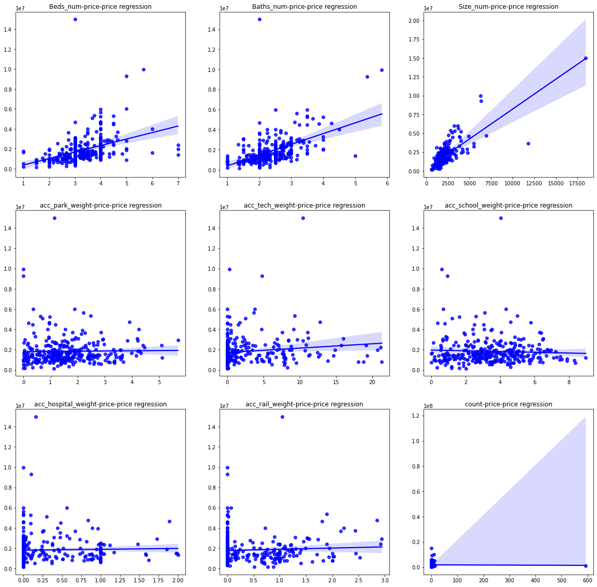
    


```python
coefficients=pd.DataFrame(gwr_results.params)
mean_coeff=coefficients.mean()
```


    1    169105.871751
    2    132696.219426
    3       615.357686
    4     60362.336471
    5    -37893.156322
    6     38507.933756
    7    -79786.396755
    8    -34017.326252
    9     22173.200620
    dtype: float64


```python
P_values=pd.DataFrame([0.2,0.0,0.0,0.098,0.0,0.866,0.571,0.272,0.814])
```


```python
#Visualize P-values & Coefficients
fig, ax = plt.subplots(1,2,figsize=(20,7))

sns.barplot(x=np.arange(9), y=P_values[0], color="blue",ax=ax[0])
sns.barplot(x=np.arange(9), y=mean_coeff[1:10], color="blue",ax=ax[1])

ax[0].axhline(0, color="k", clip_on=False)
ax[1].axhline(0, color="k", clip_on=False)

ax[0].set_xlabel("Variable")
ax[0].set_ylabel("P-value")

ax[1].set_xlabel("Variable")
ax[1].set_ylabel("Mean_coefficient")
```


    Text(0, 0.5, 'Mean_coefficient')


    
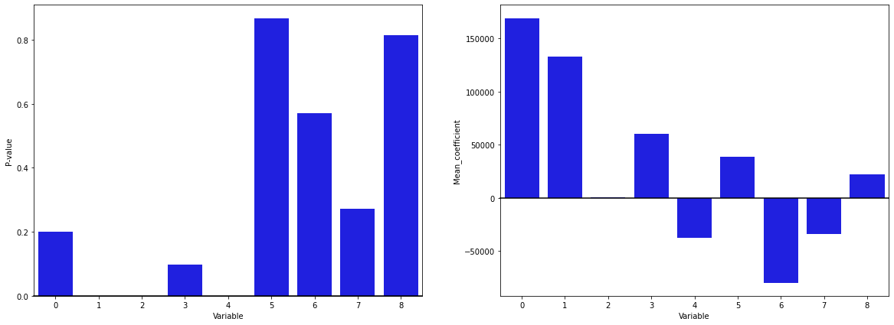
    


```python
final_geo['R2']=gwr_results.localR2
final_geo['R2_str']=1e8*final_geo['R2']/final_geo['ALAND10']
final_geo['geometry'] = gpd.GeoSeries.from_wkt(final_geo['geometry'])
```


```python
#Visualize Results-Local R2
fig, ax = plt.subplots(figsize=(10, 10))
final_geo.plot(column='R2_str', cmap = 'Oranges', linewidth=0.01, scheme = 'FisherJenks', k=5, legend=True, legend_kwds={'bbox_to_anchor':(1.10, 0.96)},  ax=ax)
ax.set_title('Local R2_str', fontsize=12)
ax.axis("off")
plt.show()
```


    
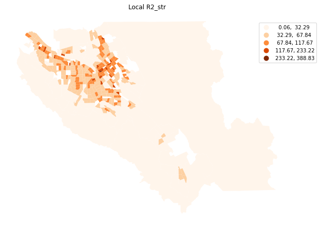
    


```python
# Normalize Coefficients
final_geo['gwr_intercept_str']=gwr_results.params[:,0]/final_geo['ALAND10']
final_geo['gwr_beds_str']=gwr_results.params[:,1]/final_geo['ALAND10']
final_geo['gwr_baths_str']=gwr_results.params[:,2]/final_geo['ALAND10']
final_geo['gwr_size_str']=gwr_results.params[:,3]/final_geo['ALAND10']
final_geo['gwr_park_str']=gwr_results.params[:,4]/final_geo['ALAND10']
final_geo['gwr_tech_str']=gwr_results.params[:,5]/final_geo['ALAND10']
final_geo['gwr_school_str']=gwr_results.params[:,6]/final_geo['ALAND10']
final_geo['gwr_hospital_str']=gwr_results.params[:,7]/final_geo['ALAND10']
final_geo['gwr_rail_str']=gwr_results.params[:,8]/final_geo['ALAND10']
final_geo['gwr_crime_str']=gwr_results.params[:,9]/final_geo['ALAND10']
```


```python
gwr_filtered_t = gwr_results.filter_tvals(alpha = 0.05)
pd.DataFrame(gwr_filtered_t)
```


<div>
<style scoped>
    .dataframe tbody tr th:only-of-type {
        vertical-align: middle;
    }

    .dataframe tbody tr th {
        vertical-align: top;
    }

    .dataframe thead th {
        text-align: right;
    }
</style>
<table border="1" class="dataframe">
  <thead>
    <tr style="text-align: right;">
      <th></th>
      <th>0</th>
      <th>1</th>
      <th>2</th>
      <th>3</th>
      <th>4</th>
      <th>5</th>
      <th>6</th>
      <th>7</th>
      <th>8</th>
      <th>9</th>
    </tr>
  </thead>
  <tbody>
    <tr>
      <th>0</th>
      <td>0.0</td>
      <td>0.000000</td>
      <td>0.0</td>
      <td>9.207057</td>
      <td>0.0</td>
      <td>0.0</td>
      <td>0.0</td>
      <td>0.0</td>
      <td>0.0</td>
      <td>0.0</td>
    </tr>
    <tr>
      <th>1</th>
      <td>0.0</td>
      <td>0.000000</td>
      <td>0.0</td>
      <td>9.651859</td>
      <td>0.0</td>
      <td>0.0</td>
      <td>0.0</td>
      <td>0.0</td>
      <td>0.0</td>
      <td>0.0</td>
    </tr>
    <tr>
      <th>2</th>
      <td>0.0</td>
      <td>0.000000</td>
      <td>0.0</td>
      <td>9.771978</td>
      <td>0.0</td>
      <td>0.0</td>
      <td>0.0</td>
      <td>0.0</td>
      <td>0.0</td>
      <td>0.0</td>
    </tr>
    <tr>
      <th>3</th>
      <td>0.0</td>
      <td>0.000000</td>
      <td>0.0</td>
      <td>9.915856</td>
      <td>0.0</td>
      <td>0.0</td>
      <td>0.0</td>
      <td>0.0</td>
      <td>0.0</td>
      <td>0.0</td>
    </tr>
    <tr>
      <th>4</th>
      <td>0.0</td>
      <td>2.854166</td>
      <td>0.0</td>
      <td>10.422471</td>
      <td>0.0</td>
      <td>0.0</td>
      <td>0.0</td>
      <td>0.0</td>
      <td>0.0</td>
      <td>0.0</td>
    </tr>
    <tr>
      <th>...</th>
      <td>...</td>
      <td>...</td>
      <td>...</td>
      <td>...</td>
      <td>...</td>
      <td>...</td>
      <td>...</td>
      <td>...</td>
      <td>...</td>
      <td>...</td>
    </tr>
    <tr>
      <th>318</th>
      <td>0.0</td>
      <td>0.000000</td>
      <td>0.0</td>
      <td>2.781975</td>
      <td>0.0</td>
      <td>0.0</td>
      <td>0.0</td>
      <td>0.0</td>
      <td>0.0</td>
      <td>0.0</td>
    </tr>
    <tr>
      <th>319</th>
      <td>0.0</td>
      <td>0.000000</td>
      <td>0.0</td>
      <td>2.759981</td>
      <td>0.0</td>
      <td>0.0</td>
      <td>0.0</td>
      <td>0.0</td>
      <td>0.0</td>
      <td>0.0</td>
    </tr>
    <tr>
      <th>320</th>
      <td>0.0</td>
      <td>0.000000</td>
      <td>0.0</td>
      <td>2.760156</td>
      <td>0.0</td>
      <td>0.0</td>
      <td>0.0</td>
      <td>0.0</td>
      <td>0.0</td>
      <td>0.0</td>
    </tr>
    <tr>
      <th>321</th>
      <td>0.0</td>
      <td>0.000000</td>
      <td>0.0</td>
      <td>2.804579</td>
      <td>0.0</td>
      <td>0.0</td>
      <td>0.0</td>
      <td>0.0</td>
      <td>0.0</td>
      <td>0.0</td>
    </tr>
    <tr>
      <th>322</th>
      <td>0.0</td>
      <td>0.000000</td>
      <td>0.0</td>
      <td>3.569390</td>
      <td>0.0</td>
      <td>0.0</td>
      <td>0.0</td>
      <td>0.0</td>
      <td>0.0</td>
      <td>0.0</td>
    </tr>
  </tbody>
</table>
<p>323 rows × 10 columns</p>
</div>


```python
gwr_filtered_tc = gwr_results.filter_tvals()
pd.DataFrame(gwr_filtered_tc)
```


<div>
<style scoped>
    .dataframe tbody tr th:only-of-type {
        vertical-align: middle;
    }

    .dataframe tbody tr th {
        vertical-align: top;
    }

    .dataframe thead th {
        text-align: right;
    }
</style>
<table border="1" class="dataframe">
  <thead>
    <tr style="text-align: right;">
      <th></th>
      <th>0</th>
      <th>1</th>
      <th>2</th>
      <th>3</th>
      <th>4</th>
      <th>5</th>
      <th>6</th>
      <th>7</th>
      <th>8</th>
      <th>9</th>
    </tr>
  </thead>
  <tbody>
    <tr>
      <th>0</th>
      <td>0.0</td>
      <td>0.000000</td>
      <td>0.0</td>
      <td>9.207057</td>
      <td>0.0</td>
      <td>0.0</td>
      <td>0.0</td>
      <td>0.0</td>
      <td>0.0</td>
      <td>0.0</td>
    </tr>
    <tr>
      <th>1</th>
      <td>0.0</td>
      <td>0.000000</td>
      <td>0.0</td>
      <td>9.651859</td>
      <td>0.0</td>
      <td>0.0</td>
      <td>0.0</td>
      <td>0.0</td>
      <td>0.0</td>
      <td>0.0</td>
    </tr>
    <tr>
      <th>2</th>
      <td>0.0</td>
      <td>0.000000</td>
      <td>0.0</td>
      <td>9.771978</td>
      <td>0.0</td>
      <td>0.0</td>
      <td>0.0</td>
      <td>0.0</td>
      <td>0.0</td>
      <td>0.0</td>
    </tr>
    <tr>
      <th>3</th>
      <td>0.0</td>
      <td>0.000000</td>
      <td>0.0</td>
      <td>9.915856</td>
      <td>0.0</td>
      <td>0.0</td>
      <td>0.0</td>
      <td>0.0</td>
      <td>0.0</td>
      <td>0.0</td>
    </tr>
    <tr>
      <th>4</th>
      <td>0.0</td>
      <td>2.854166</td>
      <td>0.0</td>
      <td>10.422471</td>
      <td>0.0</td>
      <td>0.0</td>
      <td>0.0</td>
      <td>0.0</td>
      <td>0.0</td>
      <td>0.0</td>
    </tr>
    <tr>
      <th>...</th>
      <td>...</td>
      <td>...</td>
      <td>...</td>
      <td>...</td>
      <td>...</td>
      <td>...</td>
      <td>...</td>
      <td>...</td>
      <td>...</td>
      <td>...</td>
    </tr>
    <tr>
      <th>318</th>
      <td>0.0</td>
      <td>0.000000</td>
      <td>0.0</td>
      <td>2.781975</td>
      <td>0.0</td>
      <td>0.0</td>
      <td>0.0</td>
      <td>0.0</td>
      <td>0.0</td>
      <td>0.0</td>
    </tr>
    <tr>
      <th>319</th>
      <td>0.0</td>
      <td>0.000000</td>
      <td>0.0</td>
      <td>0.000000</td>
      <td>0.0</td>
      <td>0.0</td>
      <td>0.0</td>
      <td>0.0</td>
      <td>0.0</td>
      <td>0.0</td>
    </tr>
    <tr>
      <th>320</th>
      <td>0.0</td>
      <td>0.000000</td>
      <td>0.0</td>
      <td>0.000000</td>
      <td>0.0</td>
      <td>0.0</td>
      <td>0.0</td>
      <td>0.0</td>
      <td>0.0</td>
      <td>0.0</td>
    </tr>
    <tr>
      <th>321</th>
      <td>0.0</td>
      <td>0.000000</td>
      <td>0.0</td>
      <td>2.804579</td>
      <td>0.0</td>
      <td>0.0</td>
      <td>0.0</td>
      <td>0.0</td>
      <td>0.0</td>
      <td>0.0</td>
    </tr>
    <tr>
      <th>322</th>
      <td>0.0</td>
      <td>0.000000</td>
      <td>0.0</td>
      <td>3.569390</td>
      <td>0.0</td>
      <td>0.0</td>
      <td>0.0</td>
      <td>0.0</td>
      <td>0.0</td>
      <td>0.0</td>
    </tr>
  </tbody>
</table>
<p>323 rows × 10 columns</p>
</div>


```python
gwr_var=['gwr_intercept_str','gwr_beds_str','gwr_baths_str','gwr_size_str','gwr_park_str','gwr_tech_str','gwr_school_str','gwr_hospital_str','gwr_rail_str','gwr_crime_str']
```


```python
#Visualize Results-coefficients
fig, ax = plt.subplots(10,3, figsize=(27,60))
x=0
for i in np.arange(10):
        final_geo.plot(column=gwr_var[i], cmap = 'Oranges', linewidth=0.01, scheme = 'FisherJenks', k=5, legend=True, legend_kwds={'bbox_to_anchor':(0, 0.96)},  ax=ax[i,0])
        
        final_geo.plot(column=gwr_var[i], cmap = 'Oranges', linewidth=0.05, scheme = 'FisherJenks', k=5, legend=False, legend_kwds={'bbox_to_anchor':(1.5, 0.96)},  ax=ax[i,1])
        final_geo[gwr_filtered_t[:,i] == 0].plot(color='white', linewidth=0.05, edgecolor='black', ax=ax[i,1])
        
        final_geo.plot(column=gwr_var[i], cmap = 'Oranges', linewidth=0.05, scheme = 'FisherJenks', k=5, legend=False, legend_kwds={'bbox_to_anchor':(1.5, 0.96)},  ax=ax[i,2])
        final_geo[gwr_filtered_tc[:,i] == 0].plot(color='white', linewidth=0.05, edgecolor='black', ax=ax[i,2])
        
        plt.tight_layout()
        ax[i,0].axis("off")
        ax[i,1].axis("off")
        ax[i,2].axis("off")
        ax[i,0].set_title('(a) GWR:  (BW: ' + str(gwr_bw) +'), all coeffs '+ gwr_var[i], fontsize=12)
        ax[i,1].set_title('(b) GWR:  (BW: ' + str(gwr_bw) +'), significant coeffs '+ gwr_var[i], fontsize=12)
        ax[i,2].set_title('(c) GWR:  (BW: ' + str(gwr_bw) +'), significant coeffs and corr. p-values '+ gwr_var[i], fontsize=12)


plt.show()
```


    
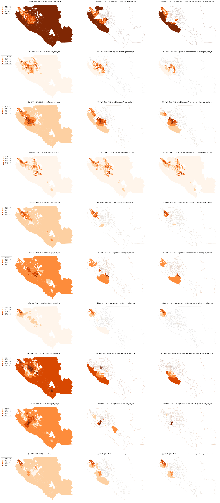
    


```python
#Visualize Results-multicollinearity
LCC, VIF, CN, VDP = gwr_results.local_collinearity()
pd.DataFrame(VIF)
pd.DataFrame(VIF).describe().round(2)
pd.DataFrame(CN)
final_geo['gwr_CN'] = CN
final_geo['CN_str']=1e8*final_geo['gwr_CN']/final_geo['ALAND10']
```


```python
fig, ax = plt.subplots(figsize=(10, 10))
final_geo.plot(column='CN_str', cmap = 'Oranges', linewidth=0.01, scheme = 'FisherJenks', k=5, legend=True, legend_kwds={'bbox_to_anchor':(1.10, 0.96)},  ax=ax)
ax.set_title('Local multicollinearity (CN > 30)?', fontsize=12)
ax.axis("off")
#plt.savefig('myMap.png',dpi=150, bbox_inches='tight')
plt.show()
```


    
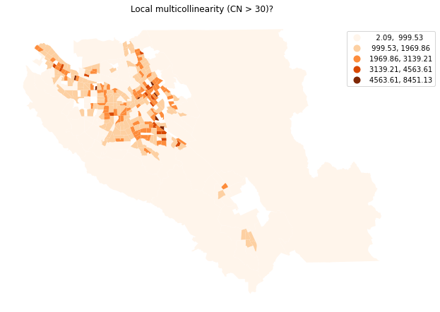
    


  

## III-Conclusions + Contributions + Limitations

  

#### 1.Conclusions

From the analysis above, several key findings can be concluded:
*  In both the GWR model and basic regression model, compared with environmental & locational factors, **structural factors including beds/baths/sizes have more significant influences on housing prices**. These factors tend to have larger coefficients and less P-value (1%-10%).


*  In both models, two of the environmental factors are statistically significant: **Park Accessibility** and **Tech Company Accessibility**. While these two factors have a generally positive influence on housing prices in the first model, results in the second model show diversified influences of factors due to potential geographical differences.


*  In the second model, we can see housing prices in areas such as **West Santa Clara (Palo Alto, etc.)** are influenced by comprehensive factors (structural+environmental+locational), while areas like **East Santa Clara (Downtown San Jose)** are less influenced by environmental and locational factors (Park/Tech/School Accessibility). The demograhical analysis also shows that East Santa Clara has **a lager population density**, especially **hispanic population.**


*  Compared with the basic regression model **(R2=0.586)**, the GWR model has a larger **R2=0.706**, which indicates the GWR model can provide a more suitable fit to the data collected by considering geographical weights.


#### 2.Contributions

The study can be used by future **home buyers/city planners/urban designers** as a reference to **make purchase decisions/develop affordable housing projects+service facilities** in different areas of Santa Clara County. For example, more mix-used affordable housing+public space projects in Downtown San Jose to increase both affordability and park accessibility for vulnerable groups.

#### 3.Limitations

Due to time limits, data collection is not perfect. Threre are many other possible factors that have not been taken into consideration. Also some databases are not large enough to be used to do analysis (e.g., there are only around 1000 records in the real estate dataset).

  

## IV-References

[1]Piotr Czembrowski, Jakub Kronenberg, Hedonic pricing and different urban green space types and sizes: Insights into the discussion on valuing ecosystem services, Landscape and Urban Planning, Volume 146, 2016, Pages 11-19, ISSN 0169-2046, https://doi.org/10.1016/j.landurbplan.2015.10.005.


[2]AM-34 - The Geographically Weighted Regression Framework,UCGIS, https://gistbok.ucgis.org/bok-topics/geographically-weighted-regression-framework

[3]Spatial Regression, Geographic Data Science with PySAL and the pydata stack, http://darribas.org/gds_scipy16/ipynb_md/08_spatial_regression.html

[4]Introduction to GWR and MGWR,Carlos Mendez [PYTHON] GWR and MGWR, deepnote.com, https://deepnote.com/@carlos-mendez/PYTHON-GWR-and-MGWR-71dd8ba9-a3ea-4d28-9b20-41cc8a282b7a
